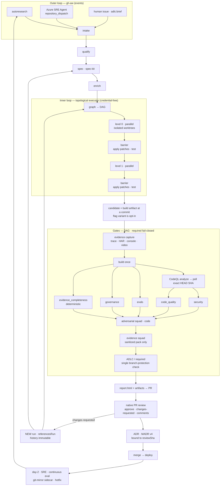

# ADLC — Agentic Development Lifecycle Framework

> A reusable, side-loadable framework that runs a governed, evidence-producing
> agentic SDLC in **any** GitHub repo. Assembled entirely from existing
> GitHub / Microsoft / Azure / CNCF products. Nothing invented.
>
> **Revision 2** — restructured after adversarial critique. Changes listed in §11.

---

## 1. Problem & Approach

**Problem.** An autoresearch loop proposes work → it is qualified, enriched and specced
→ decomposed into a parallel task graph → built as isolated candidate implementations
→ exercised to produce telemetry and replayable evidence → gated by security, quality,
eval/rubric, governance and adversarial-agent review → presented to humans as an
interactive report → decided, with every decision written as an auditable ADR → and
operated in production with a day-2 loop that feeds back into requirements.

**Four ideas do all the work:**

1. **Immutable stage results + one reducer.** Every stage writes a *new* file
   `runs/<run>/stages/<stage>.<attempt>.json` and never mutates a shared document.
   `adlc reduce` folds them into `run.json` (`adlc-run/v1`). This is the only model that
   survives GitHub Actions, where jobs share no filesystem and run concurrently. Re-runs
   are new attempts, never overwrites. **Audit history is append-only.**

2. **OES is an exporter, not the canonical record.** The
   [Open Experiment Specification](https://www.openexperiment.org/) v0.1.0 is real and
   its schema is published — but it models an *online A/B experiment* (traffic
   allocation, randomization units, SRM, p-values), and its `artifacts[].type` enum
   (`chart|screenshot|sql|notebook|csv|dashboard|slide|image|html_report`) cannot even
   name a trace, HAR or JSONL. Forcing every build run into it manufactures meaningless
   nulls. So: `adlc export oes RUN` emits a valid OES document **only when the run is
   genuinely comparative** (≥ 2 variants with measured outcomes). Gates map to
   `qualityChecks[]`, candidates to `variants[].featureFlagKeys`/`codeReferences`, the
   verdict to `decision`, the rest to `extensions["adlc:*"]`. A run carries an optional
   `experimentRef`; **a run is not an experiment.**

3. **The spine ships a working default for every seam.** Every pluggable point has a
   built-in, credential-free implementation that already passes acceptance. Adapters
   (Copilot, ASSERT, CodeQL, LaunchDarkly, Azure…) are *pure additions* registered via
   entry points. This is what makes a one-shot swarm safe: **no leaf can block or break
   the spine.**

4. **Two loops, correctly assigned.**
   - **gh-aw** = event-driven CI (triggers, least-privilege agent execution,
     `safe-outputs`, network firewall).
   - **A ~150-line topological asyncio executor** = the DAG runner. Default because it is
     credential-free, testable, and identical in CLI and Actions.
   - **Microsoft Agent Framework** owns what it is genuinely best at: **governed agent
     invocation** — `ChatClientAgent` + function/agent **middleware**, the documented
     seam where Agent Governance Toolkit `govern()` enforcement wraps every tool call.
     MAF is not a third scheduler.

**Two acceptance profiles, honestly labelled** (§8): a *credentialless conformance*
suite that proves the framework, and an *opt-in real-agent smoke* suite that proves live
Copilot/ASSERT/CodeQL integration. The first is never called an agent proof.

---

## 2. Verified Toolchain

| Capability | Product | Status | Role |
|---|---|---|---|
| Event-driven CI agents | **`github/gh-aw`** | GA | `.github/workflows/*.md` → `gh aw compile` → `.lock.yml`; `safe-outputs`, firewall, `engine.agent:` |
| Spec-driven development | **`github/spec-kit`** | GA | Scripts are non-interactive with `--json` — CI calls them directly |
| Coding agents | Copilot **cloud agent**, Agent Tasks API, `gh agent-task` | API/CLI **preview** | Optional `AgentRunner` adapter |
| Programmatic agents | **Copilot SDK** | GA | Optional `AgentRunner` — needs entitlement, so **not** credential-free |
| Task store | **Sub-issues API** + Projects v2 | GA | Optional; default is `taskgraph.json` + SQLite |
| Security | **CodeQL**, secret scanning, dependency-review | GA | Optional gate adapters; free defaults are local `gitleaks` + `pip-audit`/`npm audit` |
| Code quality | **GitHub Code Quality** | GA (2026-07) | Enabled in **repo/org Settings**; `analysis-kinds: code-scanning,code-quality` |
| Governed agent calls | **`microsoft/agent-framework`** | Preview | `ChatClientAgent` + middleware |
| Agent governance | **`microsoft/agent-governance-toolkit`** | Public preview | `govern()`, `policy.yaml`, `agt verify --evidence --strict` |
| Spec → eval suite | **`responsibleai/ASSERT`** | Active OSS | Systematize → generate → infer → judge; JSON/JSONL out |
| Feature flags | **OpenFeature** + **flagd** | GA | `flags.flagd.json` file provider = free default |
| Experiment vendor | **LaunchDarkly** + OpenFeature provider | GA | Flag delivery + metric emission only — **not** a gate authority |
| Experiment record | **OES v0.1.0** | Draft, schema published | Export target |
| Rubric evals | **promptfoo** `llm-rubric` | GA | Optional; default is a deterministic rubric runner |
| Evidence | **Playwright** (trace/video/HAR/console), Lighthouse CI, k6, axe | GA | Playwright is the spine default |
| Telemetry | **OpenTelemetry** GenAI + `feature_flag.*` semconv | Experimental/RC | `feature_flag.result.variant`, `.context.id`, `.set.id` |
| Day-2 | **Azure SRE Agent** | Preview | Documented: creates issues, comments, reads Dependabot alerts, **triggers and tracks Actions workflows**. Whether it authors code diffs is **undocumented either way** — ADLC does not depend on it doing so |
| ADR | **MADR v4** | Stable | |

**Designed-around gaps.** Each of these is a thing we could not confirm, not a thing
we confirmed to be absent. The distinction matters: a negative claim about a preview
product is rarely checkable, so ADLC is built to be correct either way.

- **Foundry SWE-agent**: we found no such product and nothing asserting its absence.
  We substitute a hosted agent (or plain container job) running `adlc hotfix`. That
  substitution is checkable; the negative is not.
- **Azure SRE Agent authoring code diffs**: undocumented either way. Our
  `repository_dispatch` receiver is justified independently — a pull request authored
  outside ADLC arrives with no run directory, no evidence, no gates and no ADR
  lineage, so routing incidents through dispatch is correct regardless.
- **SRE Agent provisioning**: portal onboarding is documented; no `az`/Bicep path found.
- **Issue-dependency creation API**: unverified, so `taskgraph.json` stays authoritative
  and sub-issues provide the GitHub-native tree.
- **LaunchDarkly experiment-results read API**: unverified, so LD delivers flags and
  emits metrics but is never a gate authority.

---

## 3. Architecture



**Loops are bounded and immutable:** a revision never mutates a prior run; it creates a
new run with `referencesRun`. `maxInnerIterations` = 2, `maxOuterIterations` = 1.

---

## 4. Frozen Contracts

> Frozen so packets build **against the spec, not each other's code**. JSON Schemas for
> every artifact below live in `schemas/` and are the acceptance oracle.

### 4.1 Run directory

```
.adlc/
├── config.yaml           policy.yaml         squads.yaml
├── capabilities.json     # written by `adlc doctor`
└── runs/<run-id>/
    ├── run.json                       # adlc-run/v1  ← reduced, canonical
    ├── stages/<stage>.<attempt>.json  # immutable stage results (append-only)
    ├── brief.md          qualification.json
    ├── spec/                          # spec-kit: spec.md plan.md tasks.md contracts/
    ├── enrichment/                    # *.mmd, wireframe.excalidraw, personas.md,
    │                                  #   features/*.feature, benchmarks.yaml, rubric.yaml
    ├── taskgraph.json
    ├── patches/<task-id>.patch        # anchored to an exact base SHA
    ├── evidence/<variant>/            # trace.zip video.webm network.har console.jsonl
    │                                  #   screenshots/ otel.jsonl lighthouse.json
    │                                  #   k6.json axe.json replay.spec.ts
    ├── evidence-review-pack.json      # sanitized, allowlisted (§4.6)
    ├── evals/            gates/<gate>.json      reviews/*.md
    ├── report.html       oes.json     # exported, conditional
docs/decisions/NNNN-*.md               # ADRs — permanent, git-tracked
```

### 4.2 `run.json` — `adlc-run/v1` (canonical)

```jsonc
{
  "schemaVersion": "adlc-run/v1",
  "runId": "2026-08-19-a1b2",
  "createdAt": "…", "referencesRun": null,
  "repo": "owner/name", "baseSha": "…", "headSha": "…", "prNumber": 42,
  "status": "draft|specced|built|evaluated|gated|reported|decided|abandoned",
  "profile": "minimal|full",
  "capabilities": { "agentRunner": "fake|copilot-sdk|agent-task", "…": "…" },
  "stages":  [ {"stage":"graph","attempt":1,"status":"ok","startedAt":"…",
                "endedAt":"…","outputs":["taskgraph.json"],"digest":"sha256:…"} ],
  "variants":[ {"key":"control","role":"control","commit":"…","flagKeys":[]},
               {"key":"candidate-a","role":"treatment","commit":"…",
                "flagKeys":["adlc.exp.a1b2"]} ],
  "gates":   [ {"id":"security","required":true,"status":"pass|fail|not_run",
                "severity":"…","observed":{},"expected":{},"message":"…",
                "evidence":["gates/security.json"]} ],
  "artifacts":[{"path":"evidence/candidate-a/trace.zip","kind":"playwright_trace",
                "mimeType":"application/zip","sha256":"…","bytes":12345}],
  "decision": {"outcome":"ship|do_not_ship|iterate|rerun","rationale":"…",
               "decidedBy":"…","decidedAt":"…","reviewSha":"…","adr":"0004"},
  "experimentRef": null
}
```

**Invariants (acceptance-tested):**
- `stages[]` is append-only; a re-run appends `attempt: n+1`, never edits.
- **Only `adlc reduce` writes `run.json`.** Stages never do. This eliminates every
  concurrent-write race across parallel Actions jobs.
- `gates[]`: **`required: true` + `not_run` ⇒ the aggregate FAILS.** Fail closed.
- Every `artifacts[]` entry carries a verified `sha256`.

### 4.3 `taskgraph.json` — bounded context capsules

```jsonc
{
  "runId":"…", "baseSha":"…", "specDigest":"sha256:…",
  "nodes":[{
    "id":"T003", "title":"…", "kind":"implement|test|doc|infra",
    "dependsOn":["T001"], "level":1,
    "writeSet":["src/theme.ts","src/theme.test.ts"],   // declared up front
    "acceptance":["US1-AC2"], "rubricIds":["R-perf-01"], "adrRefs":["0004"],
    "context":{                                        // CAPSULE — a cache, not truth
      "refs":[{"path":"src/app.ts","blobSha":"…","lines":[[1,60]],
               "symbols":["mount"],"excerpt":"…"}],
      "interfaces":"…", "conventions":"…",
      "commands":{"test":"…","lint":"…","build":"…"},
      "doNotTouch":[".github/**",".adlc/**","schemas/**","docs/decisions/**"],
      "budget":{"maxTotalBytes":65536,"maxFileBytes":8192,"maxFiles":12}
    }
  }]
}
```

**Capsule rules:** default is path + blob SHA + symbols + line ranges; full content only
for small explicit files; hard caps 64 KiB total / 8 KiB per file / 12 files; **never**
binaries, vendored, generated, `.env`, HAR or secrets; capsules are **regenerated after
every level barrier**; a `blobSha` mismatch at execution time fails the node and triggers
replan. Agents may retrieve more, read-only, within allowed paths.

### 4.4 Task isolation & merge protocol

1. Each node executes in an isolated worktree at `baseSha`.
2. Output is a **patch** (`patches/<task-id>.patch`) anchored to that exact SHA.
3. **Overlapping `writeSet` between two nodes at the same level is a graph error**,
   detected at compile time — not discovered at merge time.
4. At each **level barrier**: apply patches in id order, fail on conflict, run
   `commands.test`, commit, advance `baseSha`, regenerate capsules.
5. A candidate is a **build artifact at a commit**, not automatically a flag variant.
   OpenFeature wiring is **opt-in** and only meaningful when the application genuinely
   exposes both code paths in one binary.

### 4.5 Ports (`adlc.ports`) — signatures frozen

```python
class StageResult(TypedDict):
    stage: str; attempt: int; status: Literal["ok","fail","skipped"]
    outputs: list[str]; digest: str; message: str; data: dict

class Adapter(Protocol):
    name: str
    kind: Literal["taskstore","flags","evals","evidence","agents",
                  "telemetry","gate","daytwo","export"]
    @staticmethod
    def detect(cfg: Config) -> tuple[bool, str]: ...      # (available, reason)

class AgentRunner(Adapter):
    async def run_task(self, node: TaskNode, worktree: Path, cfg: Config) -> TaskOutcome: ...
    # TaskOutcome = {status, patchPath, log, tokensIn, tokensOut, cost}

class TaskStore(Adapter):
    def sync(self, graph: TaskGraph) -> dict[str, str]: ...
    def update(self, node_id: str, status: str, note: str = "") -> None: ...

class EvalRunner(Adapter):
    def run(self, run: Run, rubric: Rubric) -> RubricScore: ...
    # RubricScore = {overall, threshold, passed,
    #                criteria:[{id, score, weight, passed, rationale, evidence[]}]}

class EvidenceCollector(Adapter):
    def collect(self, run: Run, variant: str, out: Path) -> list[ArtifactRef]: ...

class FlagProvider(Adapter):
    def materialize(self, run: Run) -> Path: ...          # → flags.flagd.json
    def evaluate(self, key: str, ctx: dict) -> FlagResult: ...

class GateRunner(Adapter):
    id: str; required_by_default: bool
    def evaluate(self, run: Run, cfg: Config) -> GateResult: ...
    # GateResult = {id, status, severity, observed, expected, message, evidence[]}

class Telemetry(Adapter):
    def emit(self, span: dict) -> None: ...               # OTel-shaped
```

**Spine defaults — all credential-free, all shipped in the spine:**
`agents=fake` · `taskstore=sqlite` · `evals=deterministic-rubric` ·
`evidence=playwright` · `flags=flagd-file` · `telemetry=otel-file` · gates
`tests`, `secrets_local`, `deps_local`, `evidence_completeness`.

### 4.6 `evidence-review-pack.json` — sanitized reviewer input

The evidence-review agent **never** receives raw HAR, trace, console text, replay source
or arbitrary HTML — all of it is attacker-controlled, leaks source, and is a prompt-
injection vector. It receives an allowlisted, normalized pack:

```jsonc
{ "runId":"…","candidateSha":"…","workflowRunId":"…","collector":"adlc/0.1.0",
  "requirements":[{"id":"US1-AC2","text":"…","source":"spec.md#L40"}],
  "measurements":[{"metricId":"lcp_ms","value":1820,"budget":2500,"passed":true,
                   "collector":"lighthouse","artifactSha256":"…"}],
  "coverage":[{"requirementId":"US1-AC2","evidenceKinds":["playwright_trace","screenshot"],
               "artifactSha256":["…"],"present":true}],
  "screenshots":[{"artifactSha256":"…","caption":"…","redacted":true}] }
```

The **blocking** part is deterministic: every requirement must have ≥ 1 hash-verified
artifact produced by the declared collector at the declared SHA. The LLM squad verdict is
**advisory** and must cite `artifactSha256` values; an uncited verdict is discarded.

### 4.7 Feedback = native PR review (no bespoke protocol)

| Human action | Effect |
|---|---|
| Review **Approved** | `decision.outcome = ship`; ADR status → `accepted`, bound to `reviewSha` |
| Review **Changes requested** | ADR status → `rejected`; **new** run created with `referencesRun`; routed by label `adlc:route-inner` / `adlc:route-outer` |
| Review **Comment** / inline comments | Appended as annotations to the new run's brief |

Bound to the review's commit SHA and workflow run id. Only `write`-permission users can
trigger reruns. A review on a stale SHA is rejected. `report.html` renders deep links
that pre-fill these native reviews. **No YAML-fence command protocol.**

### 4.8 Permission & trust matrix

| Job | Trigger | Token | Secrets | Runs agent-authored code |
|---|---|---|---|---|
| build / test / evidence / evals | `pull_request` | `contents: read` | **none** | yes — untrusted; network limited to firewall allowlist |
| CodeQL analyze | `pull_request` | `security-events: write` | none | no |
| gates aggregator | `workflow_run` | `checks: write` | none | no |
| report + PR comment | `workflow_run` | `pull-requests: write` | none | no |
| gh-aw agent jobs | events | read-only + `safe-outputs` | scoped | no |

Candidate patches touching `.github/**`, `.adlc/**`, `schemas/**`, `docs/decisions/**`
are **rejected at the merge barrier**.

### 4.9 CLI surface

```
adlc init [--target DIR] [--profile minimal|full] [--ref TAG]
adlc doctor [--json]
adlc run new --brief FILE | --issue N
adlc qualify|spec|enrich|graph RUN
adlc build RUN [--max-parallel N] [--runner fake|copilot-sdk|agent-task]
adlc evidence RUN --variant KEY
adlc eval RUN
adlc gate RUN --ids security,code_quality,evals,…
adlc reduce RUN                     # stages/*.json → run.json  (the only writer)
adlc report RUN
adlc adr new|list|set-status
adlc review apply RUN --event FILE  # native PR review payload
adlc export oes RUN                 # only if the run is comparative
adlc validate RUN
adlc autoresearch | adlc hotfix --incident FILE
```

All commands: idempotent, `--json`, non-zero exit on required-gate failure.

---

## 5. Repository Layout

```
GitHub-ADLC/
├── .github/workflows/          # ← reusable workflows MUST live here for cross-repo `uses:`
│   ├── adlc.yml                #   the single versioned entry point consumers call
│   ├── adlc-*.md + adlc-*.lock.yml # gh-aw sources + compiled (dogfood)
├── .github/agents/*.agent.md   #   squad members
├── src/adlc/
│   ├── cli.py config.py ports.py runs.py reduce.py schemas.py executor.py
│   ├── stages/  adapters/  maf/  templates/
├── schemas/                    # adlc-run, taskgraph, rubric, benchmarks,
│                               #   evidence-review-pack
├── templates/                  # what `adlc init` vendors (thin caller + config only)
├── examples/{briefs,azure}/
├── docs/  docs/decisions/
├── bootstrap.sh                # installs the CLI, then runs `adlc init`
└── tests/{conformance,smoke}/
```

`adlc init` vendors **only** `.github/workflows/adlc.yml` (pinned to a tag),
`.adlc/{config,policy,squads}.yaml`, and a `.gitignore` entry for run artifacts.
It never overwrites existing files unless `--force` is supplied and records the
installed version in `config.yaml`.

---

## 6. Swarm Packets — 1 spine + 10 independent leaves

The spine is a **single agent's exclusive scope** so it stays internally coherent. Every
leaf is a *pure addition* registered by entry point against §4; a leaf can fail without
affecting acceptance.

### S — Spine (must land)

Owns `src/adlc/**` core, `schemas/**`, `tests/conformance/**`, `pyproject.toml`,
`.github/workflows/adlc.yml`, `actions/**`, `templates/**`, `bootstrap.sh`, `examples/**`.

Delivers, working offline end-to-end: run model + immutable stages + `reduce`;
topological asyncio executor with worktree isolation, patch barriers and write-set
conflict detection; `fake` AgentRunner (deterministic, fixture-driven); bounded context
capsules; spec-kit wrapper (minimum commands → `spec.md` + `tasks.md`); minimal
enrichment (1 Gherkin file, 1 rubric, 1 benchmark); deterministic rubric runner; one
Playwright evidence capture; the 4 default gates + required/optional + fail-closed
aggregator; static `report.html`; ADR engine + `review apply`; `adlc init` +
`bootstrap.sh` + the reusable workflow; conformance tests + golden fixtures.

### Leaves (parallel, independent)

| # | Leaf | Exclusive paths | Deliverable |
|---|---|---|---|
| L1 | Copilot agent runners | `adapters/agents/{copilot_sdk,agent_task,gh_aw}.py` | Real `AgentRunner`s + opt-in smoke test |
| L2 | MAF + AGT governance | `maf/**`, `adapters/gate/governance.py`, `templates/.adlc/policy.yaml` | `ChatClientAgent` + middleware where `govern()` runs; `agt verify --strict` gate |
| L3 | ASSERT + promptfoo evals | `adapters/evals/{assert_,promptfoo,azure}.py` | spec → eval suite; JSONL → `RubricScore` |
| L4 | GitHub security gates | `adapters/gate/{codeql,code_quality,dependency}.py` | Build-once → analyze → **poll exact head SHA** with timeout, fail closed; Code Quality **preflight** (assert settings-enabled; never pretend to self-enable) |
| L5 | GitHub task store | `adapters/taskstore/github.py` | Issues + sub-issues + Projects v2 |
| L6 | Richer evidence | `adapters/evidence/{lighthouse,k6,axe}.py` | Budgets from `benchmarks.yaml` |
| L7 | Flags, experiment & OES | `adapters/flags/launchdarkly.py`, `stages/experiment.py`, `adapters/export/oes.py` | LD provider; OES exporter validated against the published schema |
| L8 | gh-aw workflows & squads | `.github/workflows/*.md` + `.lock.yml`, `.github/agents/*.agent.md` | autoresearch, intake, adversarial squad, evidence squad (**sanitized pack only, no checkout, `edit-file:false`, toolsets `[issues]`**), quorum from `squads.yaml` |
| L9 | Enrichment generators | `stages/enrich_*.py`, templates | architecture/sitemap/data-model `.mmd`, `wireframe.excalidraw`, `personas.md` |
| L10 | Day-2 Azure | `adapters/daytwo/**`, `examples/azure/**` | `repository_dispatch` receiver for SRE Agent; ACA git-mirror sidecar manifest (**disabled example**); Foundry hosted-agent `adlc hotfix` definition; App Insights telemetry adapter |

---

## 7. What "represented" means — the KISS ladder

| Tier | Meaning | Items |
|---|---|---|
| **Works offline, acceptance-tested** | Real, exercised by the conformance suite | run model; DAG + isolation + patch merge; capsules; spec-kit wrap; rubric eval; Playwright evidence; 4 gates + fail-closed aggregator; report; ADR from PR review; `adlc init` + reusable workflow |
| **Real but thin** | One implementation, no options | qualification scoring, enrichment set, SQLite store, flagd file provider, OTel JSONL |
| **Detected adapter + opt-in smoke test** | Real integration, off the default path | Copilot runners, ASSERT, CodeQL/Code Quality, AGT, MAF, gh-aw squads, GitHub task store, Lighthouse/k6/axe, OES export |
| **Documented + disabled example** | Contract + manifest only | LaunchDarkly, Azure SRE Agent, Foundry hotfix, ACA git-mirror sidecar, App Insights |

A `not_run` **never** counts as green for a required gate.

---

## 8. Acceptance

### 8.1 Conformance — credentialless, the real proof

```bash
RUN=$(adlc run new --brief examples/briefs/dark-mode.md --json | jq -r .runId)
adlc qualify $RUN && adlc spec $RUN && adlc enrich $RUN && adlc graph $RUN
adlc build $RUN --max-parallel 4 --runner fake
adlc evidence $RUN --variant candidate-a && adlc eval $RUN
adlc gate $RUN --ids tests,secrets_local,deps_local,evidence_completeness --profile minimal
adlc reduce $RUN && adlc report $RUN && adlc validate $RUN
```

Green requires **all** of:
1. `run.json` validates against `adlc-run/v1`; `stages[]` stays append-only across a forced re-run.
2. `taskgraph.json` acyclic; ≥ 2 nodes share a `level` and **actually ran concurrently**
   (proven by overlapping timestamps in `stages[]`).
3. Overlapping write-sets at the same level are **rejected at graph time** (negative test).
4. Patches apply at the recorded `baseSha`; a stale-`blobSha` node fails and replans
   (negative test).
5. Every `artifacts[]` `sha256` verifies; `trace.zip`, `network.har`, `console.jsonl` exist.
6. A required gate returning `not_run` makes the aggregate **fail** (negative test).
7. `evidence-review-pack.json` contains **no** raw HAR/trace/console/replay content
   (asserted by content scan).
8. `report.html` opens standalone; renders diagrams, evidence index, ADR + review deep links.
9. `adlc review apply` on a `changes_requested` fixture creates a **new** run with
   `referencesRun` and leaves the prior run byte-identical.
10. ≥ 1 MADR v4 ADR in `docs/decisions/`, bound to `reviewSha`.
11. A clean consumer repository can be installed by `adlc init` and
    `bootstrap.sh`, then run the same flow via the pinned reusable workflow.
12. Kill-and-resume: interrupting `adlc build` and re-running resumes from the last
    completed level barrier.

### 8.2 Real-agent smoke — opt-in, declared cost

`--runner copilot-sdk` on a 2-node graph; ASSERT eval; CodeQL + Code Quality gate on a
real PR; one gh-aw squad review posting via `safe-outputs`. Skipped — and reported as
`not_run` with a reason — when credentials are absent.

---

## 9. Risks

| Risk | Mitigation |
|---|---|
| Swarm produces non-composing work | Spine is one agent's exclusive scope and ships a default for every seam; leaves are entry-point additions that cannot block it |
| Fail-open gates | `required` + `not_run` ⇒ fail; a single `ADLC / required` aggregator is the branch-protection target |
| Code-scanning async / stale alerts | Poll by exact head SHA + ref + category + workflow run, with timeout, fail closed |
| Prompt injection via evidence | Reviewer sees only the sanitized allowlisted pack; blocking checks are deterministic |
| Untrusted agent code + secrets | Build/eval jobs get `contents: read` and no secrets; publication runs in separate `workflow_run` jobs |
| Context bloat / staleness | Hard capsule budgets; blob-SHA validation; regeneration at every barrier |
| Preview-API churn (Agent Tasks, MAF, AGT, ASSERT) | All behind adapters, pinned versions, off the default path |
| Cost blowup | `max-turns`, `max-ai-credits`, `--max-parallel`, loop bounds in `config.yaml`; smoke suite declares cost |
| Framework becomes a second CI system | `adlc init` vendors one pinned caller workflow + namespaced config only; never touches existing CI |
| gh-aw `.lock.yml` drift | `gh aw compile` + freshness check in CI |
| OES Draft churn | Exporter only; single `adapters/export/oes.py`; ADLC data confined to `extensions["adlc:*"]` |

---

## 10. Explicitly NOT doing

No custom flag service, eval framework, task tracker, orchestrator or report SPA. No
control plane, database, web service or auth. No LaunchDarkly-results gating. No claim
that a Foundry SWE-agent SKU does or does not exist. No AKS/Terraform estate. No
YAML-fence command protocol. No more than 2 variants. No mutation of historical runs.

**And no unverified negatives stated as fact.** "We found no X" is checkable; "X does
not exist" usually is not, especially for a preview product. Where this document or the
code asserts an absence, it is because absence was demonstrated — otherwise it says what
was searched and what was found.

---

## 11. Changes from Revision 1 (post-critique)

1. **OES demoted** from canonical record to conditional exporter; `adlc-run/v1` is
   canonical. (Its artifact-type enum cannot express traces/HAR, and most runs are not
   statistical experiments.)
2. **MAF demoted** from DAG orchestrator to governed-agent-invocation + AGT middleware
   seam; a small topological executor is the default.
3. **Swarm restructured** from 12 interdependent packets to 1 spine + 10 independent
   leaves; the spine ships a default for every seam.
4. **Gates redesigned** — build once → analyze → poll exact head SHA; required vs
   optional; `not_run` on a required gate now **fails**; one aggregator check.
5. **Evidence review** now consumes a sanitized allowlisted pack; blocking checks are
   deterministic and the LLM verdict is advisory and must cite artifact hashes.
6. **Feedback protocol replaced** by native PR review events bound to a commit SHA;
   revisions create new runs instead of mutating history.
7. **Context inlining bounded** into capsules with budgets, blob SHAs and regeneration.
8. **Reusable workflows moved** to `.github/workflows/` — cross-repo `uses:` requires it;
   revision 1 placed them in `workflows/`, which would not have resolved.
9. **Added:** task isolation + patch-merge protocol; permission/trust matrix;
   concurrent-write elimination via immutable stages + a single reducer; two honestly
   labelled acceptance profiles; kill-and-resume test.
