# Day-2 operations

> **Workstream L10.** How a production incident becomes a governed, gated,
> evidence-backed change — and how running systems feed back into requirements.
>
> This document is deliberately blunt about what is built versus what is an
> example you would have to wire up yourself. Read [§6](#6-real-vs-example-only)
> before you believe anything else here.

---

## 1. The one idea

**Day-2 is not a second pipeline. It is a different way to author a brief.**

An incident arrives, becomes a `brief.md`, and enters the *ordinary day-1 intake
path*. Everything downstream — qualification, the task graph, isolated
worktrees, patch barriers, evidence capture, the fail-closed gate aggregator,
the ADR — is byte-for-byte the same code that handles a human feature request.

ADLC has two proposal sources feeding one intake:

| Source | Module | Trigger |
|---|---|---|
| **Day-1 autoresearch** | `stages/autoresearch.py` | repeatedly-failing gates, un-evaluated rubric criteria, TODO hotspots |
| **Day-2 incident** | `adapters/daytwo/sre_agent.py` + `stages/hotfix.py` | an SRE Agent `repository_dispatch` or issue |

Both emit a markdown brief with the same section vocabulary, and both hand it to
`run_intake` / `run_qualify`. Neither has a private pipeline.

```mermaid
flowchart LR
    subgraph PROD["Production"]
        APP["app + git-mirror sidecar<br/>(pinned to deployed SHA)"]
        AI["App Insights<br/>OTel spans"]
        APP --> AI
    end

    AI --> SRE["Azure SRE Agent<br/>investigates"]
    SRE -->|"repository_dispatch<br/>or issue"| RX["SreAgentReceiver<br/>payload → adlc-incident/v1"]
    RX --> BRIEF["brief.md"]

    subgraph DAY1["The existing day-1 path — unchanged"]
        BRIEF --> NEW["RunDir.create → run_intake"]
        NEW --> Q["run_qualify<br/>parks a weak brief"]
        Q --> GRAPH["narrow 3-node graph<br/>(hotfix skips spec/enrich)"]
        GRAPH --> BUILD["run_build"] --> EV["run_evidence"] --> GATE["run_gates<br/>fail-closed"]
        GATE --> RED["reduce_run → run.json"] --> REP["report + PR"]
    end

    REP --> HR["human PR review"] --> ADR["ADR · MADR v4"]
    ADR --> MERGE["merge → deploy"] --> APP
    AI -.->|"continuous eval<br/>KQL drift"| PROPOSE["proposed rubric change<br/>→ PR + ADR"]
    PROPOSE --> HR
```



The dashed line is [§5](#5-the-self-evolving-pipeline). Everything else is the
loop described below.

---

## 2. Two caveats you must not paper over

These are the two places where it would be easy — and wrong — to imply a
capability exists.

### 2.1 Azure SRE Agent: what it does, and what is unverified

Verified 2026-08-19 from
[`/azure/sre-agent/github-connector`](https://learn.microsoft.com/en-us/azure/sre-agent/github-connector).
The connector **can**, quoting the page: create issues, update issues, comment
on issues and pull requests, fetch Dependabot alerts, **trigger GitHub Actions
workflows**, and **track workflow runs**.

> **UNVERIFIED: whether the SRE Agent can autonomously author code and open a
> pull request.**
>
> ADLC's design notes state it cannot. **We could not confirm that.** The
> connector page lists "open/merge PRs" among pull-request operations, and the
> overview page says *"The agent proposes changes and your team approves. No
> change deploys without human sign-off."* — but **no page states** whether the
> agent generates code diffs itself, and **no page states that it cannot**.
>
> Pages checked: `sre-agent/github-connector`, `sre-agent/setup-github-connector`,
> `sre-agent/overview`, `sre-agent/create-and-set-up`.
>
> Do not repeat "the SRE Agent cannot open PRs" as fact. Say: *it is not
> documented to generate code fixes, and ADLC does not depend on it doing so.*

**The architecture does not rest on the answer.** ADLC is a
`repository_dispatch` / `workflow_dispatch` **receiver** because that is both a
documented capability *and* the architecturally correct seam. A pull request
authored outside ADLC — by any tool — arrives with no run directory, no task
graph, no immutable stage results, no captured evidence for
`evidence_completeness` to verify, no rubric scores and no ADR lineage. It is a
change that skipped every gate the framework exists to enforce. Dispatching a
workflow is what lets an incident enter the **governed** path.

Also verified: **there is no `az` CLI, ARM or Bicep provisioning path for the
SRE Agent.** Onboarding is the portal wizard at `sre.azure.com`. Post-creation
RBAC on *your* resources uses `az role assignment create` — exact syntax in
[`examples/azure/sre-agent-dispatch.md`](../examples/azure/sre-agent-dispatch.md).
The ARM resource-provider namespace is **UNVERIFIED**; we found no page stating it.

### 2.2 Microsoft Foundry: a substitution, not a product

**We searched for a Microsoft Foundry "SWE agent" SKU and found none.** Being
precise: we searched the Foundry agents documentation and general web search on
2026-08-19 and found no product by that or a similar name. We also found no page
asserting that such a product does *not* exist. So:

- ✅ Honest: *"We found no documented Foundry SWE-agent SKU, so we substituted
  our own."*
- ❌ Overclaiming: *"There is no Foundry SWE-agent SKU."* — **UNVERIFIED as a
  negative claim.**

**The substitution:** a Foundry **hosted agent** (`kind: hosted`, verified real
and documented) — or, more simply, a plain container job — that runs **our own**
`adlc hotfix` CLI. Rubrics come from ASSERT, generated from the incident.
Foundry supplies hosting and identity. It does not write the fix; the ADLC
pipeline does.

**A second honest gap in the same place.** A Foundry hosted agent declares
`protocols`, and `startupCommand` is documented as the command that starts the
agent *server*. `adlc hotfix` is a CLI that exits when it is done — it serves
nothing. Running it as a hosted agent needs a thin HTTP shim inside the image
that speaks the declared protocol and shells out to the CLI. **ADLC does not
ship that shim.** The plain container-job form needs no shim and is the path
that actually works.

**Format note.** `agent.yaml` / `agent.manifest.yaml` are documented as
**deprecated**; as of the `azure.ai.agents` 1.0.0-beta.1 `azd` extension all
hosted-agent config lives in a single **`azure.yaml`**. Our example emits the
current `azure.yaml` shape.

---

## 3. The loop, step by step

### Step 1 — Production emits telemetry

The app runs with an OTel exporter. If `APPLICATIONINSIGHTS_CONNECTION_STRING`
is set, `AppInsightsTelemetry` sends spans to Azure Monitor; otherwise the
spine's credential-free `otel-file` writes `otel.jsonl` and nothing changes.

Attributes are passed through **verbatim** — the adapter never renames a key.
That matters because the conventions are moving:

| Attribute | Status |
|---|---|
| `feature_flag.key`, `feature_flag.provider.name`, `feature_flag.result.variant`, `feature_flag.result.reason`, `feature_flag.context.id`, `feature_flag.set.id` | Release Candidate. The event name MUST be `feature_flag.evaluation`. |
| `feature_flag.provider_name`, `feature_flag.variant` | **Superseded** by the `.provider.name` / `.result.variant` spellings above. |
| `gen_ai.operation.name`, `gen_ai.request.model`, `gen_ai.response.model`, `gen_ai.usage.input_tokens`, `gen_ai.usage.output_tokens` | Development. |
| `gen_ai.system` | **Superseded by `gen_ai.provider.name`.** The adapter does *not* rewrite it — silently "correcting" it would make Azure Monitor disagree with the run's own JSONL evidence. |

Optional storage aid: the ACA **git-mirror sidecar**
([`container-app-with-git-mirror.bicep`](../examples/azure/container-app-with-git-mirror.bicep))
keeps a mirror of the repo pinned to the deployed commit on a replica-scoped
`EmptyDir` volume, so the incident can carry an *exact* SHA rather than a guess.
It is a read-only provenance aid. **It does not hot-patch anything.**

### Step 2 — The SRE Agent investigates and dispatches

It correlates the signal, and either POSTs a `repository_dispatch` of type
`adlc-incident` or files an issue labelled `adlc:incident`. Both are supported;
the issue path leans on its best-verified capability.

### Step 3 — `SreAgentReceiver` normalises the payload

`src/adlc/adapters/daytwo/sre_agent.py` accepts, in order:

1. `repository_dispatch` → `client_payload`
2. `workflow_dispatch` → `inputs` (JSON-encoded values are decoded)
3. an `issues` event or bare issue → title/body/labels, plus any embedded
   ` ```json ` block
4. a bare incident object already in our shape

It emits `adlc-incident/v1` — **our** schema, not an Azure one. Alternative key
spellings are tolerated (`alertName`, `firedAt`, `resourceId`, `probableCause`,
`sev`, `priority`, …) and the **entire** inbound payload is preserved under
`incident["raw"]`, so nothing is lost from the audit trail.

`detect()` is env-only and returns `(False, reason)` with no payload present.

### Step 4 — Incident → brief → **the day-1 front door**

This is the KISS win, and it is worth being concrete about *why* it is a win.

`to_brief()` renders markdown using the **same section vocabulary
`stages/autoresearch.py` produces**, because
`stages/intake.py::qualify_text` scores a brief on exactly those signals: a
stated **Problem**, a **Desired outcome**, **Acceptance criteria**, bounded
**Scope**, a named audience and a measurable target.

That is not cosmetic. `run_qualify` parks any brief scoring below
`qualify.minScore` (default 50). An earlier draft of this adapter emitted a
brief that scored **45 for a terse incident** — it would have been silently
parked, breaking the day-2 loop for exactly the low-information incidents that
matter most. Every incident shape is now regression-tested against the real
scorer (`test_a_terse_incident_still_qualifies`).

Crucially, the brief is not keyword-stuffed to game the scorer. Every section
carries real content, and where the payload genuinely lacks something the brief
**says so**:

> **None supplied.** The incident carried no measurable target, so there is no
> objective threshold to restore. Define one before trusting a fix: without a
> measured signal, "resolved" is an opinion.

That honest gap is useful review signal, and it is why a signal-free incident
still scores 90 rather than 100 — the missing measurable target is real.

Then `run_hotfix` calls the spine's own functions, in process:

```python
rd = RunDir(cfg, new_run_id())
rd.create(profile=cfg.profile, brief_text=receiver.to_brief(incident))
run_intake(cfg, rd, source=f"sre-agent:{incident_id}")
run_qualify(cfg, rd)
```

Those are the *same four calls* `adlc run new --brief` makes. There is no
`adlc run new --incident`, no day-2 stage table, no parallel gate set.
Consequences:

- Day-2 inherits every future day-1 improvement for free.
- There is exactly one place where "what are we building and why" is decided.
- A hotfix cannot accidentally get a weaker bar, because it does not have its
  own bar to weaken. A brief that would be parked on day 1 is parked on day 2,
  unless a human passes `--allow-unqualified`.

### Step 5 — A narrow task graph

`adlc hotfix` writes a fixed 3-node graph and **skips `spec` and `enrich`**.
That skip is the only thing that makes it a hotfix:

| node | level | kind | purpose |
|---|---|---|---|
| `T001` | 0 | `test` | a regression test that **fails** on the current commit |
| `T002` | 1 | `implement` | the minimal fix |
| `T003` | 1 | `doc` | the incident record in `docs/incidents/` |

`T002` and `T003` share level 1, so their write sets must not overlap — one
writes code, the other writes `docs/incidents/`, so they cannot. `T001` runs
first because a hotfix with no failing test is a guess. The graph is validated
by the executor's own `validate_graph()` in the test suite, not just against the
JSON schema.

**On the fix node's write set — an honesty detail.** We cannot know which files
need changing. Resolution order is: an explicit hint in the incident payload
(`writeSet` / `suspectedFiles`) → `hotfix.writeSet` in `.adlc/config.yaml` →
a placeholder. The source is recorded in `data.writeSetSource`, and when it is
`"fallback"` the stage message says so in plain words and tells you to refine it
before trusting the build. A placeholder is never presented as analysis.

### Step 6 — Build, evidence, gates — unchanged

`run_hotfix` then calls `run_build` → `run_evidence` → `run_gates` →
`reduce_run`: the same functions the CLI drives. Evidence is captured for the
variant **`candidate-a`** — the spine's own treatment variant name, reused
rather than invented, so the report and the evidence pack agree about what was
measured.

A hotfix clears the **same** required gate set as any other change:
`tests`, `secrets_local`, `deps_local`, `evidence_completeness`. A test asserts
`HOTFIX_GATE_IDS == cfg.required_gates()`, so the two cannot drift apart.

**Fail closed.** If those gates did not run, or ran and the aggregate failed,
the stage status is `fail` and the process exits non-zero. `--allow-incomplete`
exists but is deliberately awkward to reach for.

**It never writes `run.json`.** Only `reduce_run` does (`docs/PLAN.md` §4.2),
and `run_hotfix` calls it *after* writing its own stage result so the hotfix
stage appears in the reduced document. Stage results go through
`RunDir.write_stage`, so attempts are append-only and digests match the spine's.

### Step 7 — Human review, ADR, merge

Native PR review (`docs/PLAN.md` §4.7). Approval writes an ADR bound to the
review SHA. Changes-requested creates a **new** run with `referencesRun` and
leaves the prior run byte-identical. A hotfix earns its merge exactly the way
everything else does.

---

## 4. Running it

> **Not yet wired into `adlc` itself.** `src/adlc/cli.py` is the spine's file and
> currently registers `autoresearch` but not `hotfix`. Until the spine adds a
> `hotfix` command calling `adlc.stages.hotfix:run_hotfix`, invoke the module
> directly — the behaviour is identical.

```bash
# From an incident file
python -m adlc.stages.hotfix --incident incident.json --json

# Inside GitHub Actions - GITHUB_EVENT_PATH is found automatically
python -m adlc.stages.hotfix --json

# Create the run and show the graph, but execute nothing
python -m adlc.stages.hotfix --incident incident.json --plan-only
```

| Flag | Effect |
|---|---|
| `--plan-only` | Creates the run, writes `brief.md` + `taskgraph.json`, runs no build/evidence/gate/reduce |
| `--allow-unqualified` | Proceed even if the brief scores below `qualify.minScore` |
| `--allow-incomplete` | Exit 0 even if the required gates were not evaluated |
| `--runner`, `--max-parallel` | Passed through to `run_build` |

Exit codes: `0` = stage ok **and** the required gates ran and passed (or
`--plan-only` / `--allow-incomplete`); `1` = a step failed, the brief did not
qualify, a required gate failed, or the gates did not run.

A real end-to-end run against a demo repo, with the credential-free `fake`
runner:

```text
[ok] incident INC-2026-08-19-0007 (sev2) -> brief.md + 3-node hotfix graph;
     required gates passed: tests, secrets_local, deps_local, evidence_completeness
       ok  intake: intake completed
       ok  qualify: score 100/100 (threshold 50)
       ok  graph: 3 node(s); writeSet from incident
       ok  build: 0 failed node(s)
       ok  evidence: 5 artifact(s)
       ok  gate: aggregate PASS
       ok  reduce: reduce completed
```

Remove `commands.test` from `.adlc/config.yaml` and the same run ends
`aggregate FAIL: tests: NOT_RUN … gate unavailable`, exit `1`. That is the
fail-closed rule working, not a bug.

---

## 5. The self-evolving pipeline

The appealing version of this idea is "the pipeline tunes itself". That version
is magic, and we are not building it. Here is the version that is just software.

### The problem it solves

A rubric threshold is a guess made at authoring time. Production is the only
place that tells you whether the guess was right. Today that feedback either
never arrives or arrives as a hallway conversation.

### The mechanism, concretely

1. **Measure.** Continuous eval scores flow into Application Insights.
   `adlc.rubric.id` and `adlc.rubric.score` are attributes **ADLC itself emits**
   through `AppInsightsTelemetry`.

   > **Why our own attributes and not Foundry's?** Because the schema Foundry
   > continuous evaluation writes into Application Insights is **UNVERIFIED** —
   > we found no documented table name and no documented score column. We are
   > not going to query a schema we cannot cite. See the UNVERIFIED block in
   > [`continuous-eval.kql`](../examples/azure/continuous-eval.kql), and run
   > *Query 0* to discover what your workspace actually contains.

2. **Detect drift.** *Query 4* in `continuous-eval.kql` compares each rubric's
   mean score this week against last week. It reports only movements that are
   `>= 0.05`, backed by `>= 30` samples on both sides, and flags whether the
   threshold boundary was crossed. Those numbers are arbitrary-but-explicit
   guard rails against reacting to noise.

3. **Propose — as a pull request, never an edit.** A scheduled job takes a
   drift row and opens a PR that changes **one** number in `rubric.yaml`,
   accompanied by a **MADR v4 ADR** stating:
   - the rubric id and the current threshold,
   - observed mean before and after, sample counts, the query and the window,
   - the resulting change in pass rate,
   - and the alternative considered — *"leave the threshold and fix the
     regression instead"* — because a drifting score usually means the **system**
     got worse, not that the **bar** was wrong.

4. **A human decides.** The PR goes through normal review. Approval writes the
   ADR bound to `reviewSha`; rejection creates a new run with `referencesRun`.

### The guard rails that keep it boring

| Rule | Why |
|---|---|
| The proposal changes a **threshold or rubric**, never application code | Evidence about *evaluation quality* justifies changing an *evaluation*, nothing more |
| One number per PR | A reviewer can actually check it |
| An ADR is mandatory and must cite the query and window | The evidence is inspectable, not asserted |
| Merging requires human approval | Same rule as every other change |
| The ADR must record the "fix the regression instead" alternative | Stops the loop rationalising away real regressions by lowering the bar |
| Drift thresholds and minimum sample sizes are explicit in the query | No hidden statistics |

### What it is not

It does not retrain anything, rewrite prompts, change gates, alter
`required`/`optional`, or merge on its own. It converts a measurement into a
**reviewable proposal**. That is the whole trick — and the reason it is
achievable rather than aspirational.

> **Status: designed, not shipped.** The telemetry adapter and the KQL exist.
> The scheduled job that turns a drift row into a PR is **not implemented in
> L10** — writing to `.github/workflows/**` is outside this workstream's paths.
> The queries are the contract it would build on.

---

## 6. Real vs example-only

The honest table. "Real" means credential-free, tested, and on a code path that
executes.

| Component | Status | Notes |
|---|---|---|
| `SreAgentReceiver` payload → `adlc-incident/v1` | **Real** | Unit-tested against fixtures; no network, no credentials |
| Incident → `brief.md` that clears the real qualifier | **Real** | The reuse claim, executable and regression-tested |
| `run_hotfix` driving `run_intake`/`run_qualify`/`run_build`/`run_evidence`/`run_gates`/`reduce_run` | **Real** | End-to-end green on a demo repo with the `fake` runner |
| Narrow graph passing the executor's `validate_graph()` | **Real** | Cycles, levels, write-set overlap, protected paths |
| Append-only attempts; never writes `run.json` | **Real** | Via `RunDir.write_stage`; tested |
| Fail-closed on unqualified brief / failed or missing gates | **Real** | Tested |
| `AppInsightsTelemetry` attribute pass-through & sanitisation | **Real** | Handles the spine's flat span shape; signature-compatible with `otel-file` |
| `AppInsightsTelemetry` actually shipping to Azure | **Example** | Needs `APPLICATIONINSIGHTS_CONNECTION_STRING` + `adlc[azure]` |
| `FoundryHotfixAgent` definition rendering | **Real** | Emits verified `azure.yaml` fields; YAML-parse tested |
| Foundry hosted agent actually running | **Example** | Needs a subscription **and** an HTTP protocol shim ADLC does not ship |
| Plain container job running `adlc hotfix` | **Real mechanism** | The entrypoint is real; you supply the image |
| ACA git-mirror sidecar Bicep | **Example** | Never applied by ADLC; **not** Bicep-compiled in CI |
| SRE Agent creating incidents | **Example** | Portal onboarding at `sre.azure.com`; no CLI/Bicep path |
| Continuous-eval KQL | **Example** | Query 0 first — the Foundry eval schema is UNVERIFIED |
| `hotfix` as an `adlc` CLI subcommand | **Not wired** | `cli.py` is spine-owned; use `python -m adlc.stages.hotfix` |
| Self-evolving-pipeline job | **Not implemented** | Designed above; outside L10's paths |

**With no Azure environment set, all three adapters report `(False, <reason>)`,
the spine's `otel-file` telemetry is selected, and the credential-free
conformance suite is completely unaffected.** That is the contract
(`CONTRIBUTING.md` rule 4) and it is what the tests in `tests/l10_daytwo/` check.

---

## 7. Sources

Everything asserted above was checked on **2026-08-19**. Where a claim could not
be sourced it is labelled **UNVERIFIED** with the pages searched.

- `/azure/sre-agent/github-connector`, `/setup-github-connector`, `/create-and-set-up`, `/overview`
- `/azure/foundry/agents/concepts/azure-yaml-reference` (current) and `/agent-yaml-reference` (deprecated)
- `/azure/container-apps/containers`, `/azure/container-apps/storage-mounts`
- `/azure/templates/microsoft.app/containerapps?pivots=deployment-language-bicep`
- `/azure/azure-monitor/app/opentelemetry-configuration`, `/opentelemetry-enable`, `/opentelemetry-add-modify`
- `/azure/azure-monitor/app/data-model-complete`
- `/azure/role-based-access-control/built-in-roles/{containers,general,ai-machine-learning}`
- `/cli/azure/role/assignment`
- `opentelemetry.io/docs/specs/semconv/feature-flags/feature-flags-events/`
- `github.com/open-telemetry/semantic-conventions-genai`

Known-unverified list, in one place:

1. Whether Azure SRE Agent can autonomously author code and open a PR.
2. The SRE Agent's ARM resource-provider namespace.
3. The exact roles the SRE Agent onboarding wizard assigns to its managed identity.
4. Whether a Foundry "SWE agent" SKU exists (we found none; the negative is unproven).
5. The Application Insights table/column schema for Foundry continuous-eval scores.
6. Attribute count/length caps for Application Insights `customDimensions`.
7. Role definition GUIDs for `Foundry User` / `Foundry Owner`.
8. Whether Foundry accepts a non-server `startupCommand` such as `adlc hotfix`.
