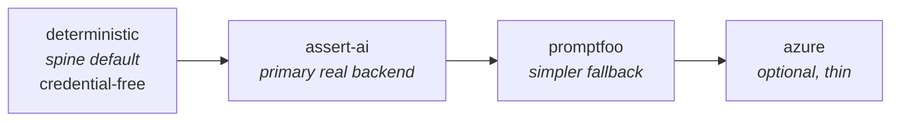
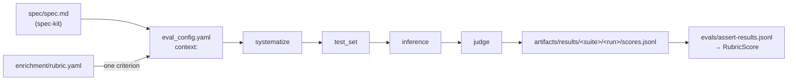

# Evals — the rubric ladder

ADLC scores every run against `runs/<run>/enrichment/rubric.yaml`
(`schemas/rubric.schema.json`) and turns the result into one gate verdict. Which *engine*
does the scoring is a swappable seam: an `EvalRunner` adapter, selected by
`adlc.config.select_adapter`.

Whatever the engine, the output is always the same frozen shape from `adlc.ports`:

```python
RubricScore = {
    "overall": float,          # weighted mean of the criteria, 0.0–1.0
    "threshold": float,
    "passed": bool,            # overall >= threshold
    "criteria": [
        {"id": str, "score": float, "weight": float,
         "passed": bool, "rationale": str, "evidence": [str]},
    ],
}
```

**That normalisation is the whole point.** The `evals` gate and `report.html` never learn
which backend ran — they only ever see a `RubricScore`.

## How a runner is invoked

`adlc.stages.evals.run_eval` owns the seam:

```python
runner = select_adapter(cfg, "evals", runner_name)
if hasattr(runner, "bind"):
    runner.bind(cfg, rd.path)          # ← implement this
score = runner.run(load_run(rd), rubric)
write_json(rd.evals_dir / "rubric-score.json", score)
```

Three consequences every backend must respect:

- **Implement `bind(cfg, run_dir)`.** It is how you learn where the run lives. All three
  L3 runners store it and prefer it over any cwd-derived guess, so they behave identically
  whether the CLI, a test, or a GitHub Actions job with a different working directory is
  driving. (`run()` still falls back to `Config.load()` + `cfg.run_dir(runId)` when nobody
  bound it.)
- **`evals/rubric-score.json` is the canonical artifact.** The *stage* writes it from your
  return value — a runner must not write it itself. `adlc.stages.report` reads exactly
  that path, and so does the gate. The `assert-score.json` / `promptfoo-score.json` /
  `azure-score.json` side artifacts the L3 backends write are a convenience for driving a
  backend directly; they are never the source of truth.
- **Never write `run.json`.** Only `adlc reduce` does. Stages write immutable
  `stages/<stage>.<attempt>.json`; you write nothing but your own working files.

### The `requires an LLM judge` marker

`run_eval` builds `stages/eval.<n>.json` → `data.unevaluated` by grepping criterion
rationales for the literal substring **`requires an LLM judge`**, and
`adlc.stages.autoresearch` aggregates *that* across runs to decide what the outer loop
should investigate next.

The spine's deterministic runner emits
`"requires an LLM judge - not evaluated by the deterministic runner"`. Every L3 backend
emits `"not evaluated by <backend> - requires an LLM judge: <specific detail>"` for a
criterion it could not judge, so an ASSERT or promptfoo gap is visible to exactly the same
machinery as a deterministic-runner gap. If you write another backend, keep the marker —
otherwise your unevaluated criteria become invisible to the feedback loop.

---

## The ladder



| Rung | Adapter | Entry point | Needs | Selected when |
|---|---|---|---|---|
| 0 | `DeterministicRubricRunner` | `deterministic` | nothing | always available; the spine default. Checks `file_exists`, `command_exit_zero`, `metric_within_budget`, `regex_in_file`; scores `kind: llm-rubric` criteria 0.0 with `requires an LLM judge` |
| 1 | `AssertEvalRunner` | `assert-ai` | `assert-ai` CLI + judge key + a target | ASSERT is installed and configured |
| 2 | `PromptfooEvalRunner` | `promptfoo` | `promptfoo` on PATH + judge key | promptfoo is installed and keyed |
| 3 | `AzureEvalRunner` | `azure` | `azure-ai-evaluation` + Azure OpenAI creds | the SDK and a deployment are configured |

Selection order (`docs/PLAN.md` §4.5): an explicit `adapters.evals` override in
`.adlc/config.yaml` wins; otherwise the first adapter whose `detect()` returns `True`, in
registration order; otherwise the spine default.

**With no credentials installed, rungs 1–3 all report `(False, "<reason>")`** and the
deterministic runner takes over. That is what keeps the credential-free conformance suite
(`docs/PLAN.md` §8.1) green. The reason string is surfaced verbatim in
`capabilities.json` and in any `not_run` gate, so it always names the exact missing piece:

```text
assert-ai: ASSERT not installed: no 'assert-ai' console script on PATH and no importable
           assert_ai module (pip install assert-ai, …)
promptfoo: promptfoo not on PATH (install with `npm install -g promptfoo`); the
           `npx promptfoo` fallback is opt-in via eval.promptfoo.useNpx …
azure:     azure-ai-evaluation is not installed (pip install 'adlc[azure]' …)
```

---

## Fail-closed rules

These are binding for every backend (`CONTRIBUTING.md` §6):

1. **A criterion that was not evaluated never passes.** It is emitted with `score: 0.0`,
   `passed: false` and a rationale prefixed `not evaluated by <backend>: …`. It is *not*
   silently dropped, and it is *not* scored as a failure "on merit" — the distinction is
   preserved in the rationale and counted in the gate's
   `observed.unevaluatedCriteria`.
2. **A backend that cannot produce a trustworthy score raises** `EvalBackendError` /
   `EvalBackendUnavailable` rather than returning a partial score. No score document is
   written, so the `evals` gate reports `not_run` — and a required `not_run` fails the
   build.
3. **`detect()` is cheap and never raises**: env-var name checks, `shutil.which`, and
   `importlib.util.find_spec` only. No network, no subprocess.

---

## The `evals` gate

`adlc.adapters.gate.evals.EvalsGate` (`id = "evals"`, `required_by_default = False`;
the `full` profile promotes it to required) reads the `RubricScore` and passes iff
`overall >= threshold`. It looks, in order:

1. the latest successful `eval` stage result in `run.json` (`stages[].data`, which carries
   `overall` / `threshold` / `passed` / `criteria` / `runner`);
2. `runs/<run>/evals/rubric-score.json` — the canonical artifact — then `score.json`,
   `rubric_score.json`, `evals.json`, `result.json`, then the per-backend side artifacts
   `assert-score.json`, `promptfoo-score.json`, `azure-score.json`, then any other
   RubricScore-shaped `*.json` in that directory.

In practice the file path is the one that fires: gates run before `adlc reduce`, so
`load_run(rd)` usually returns `seed.json` with an empty `stages[]`.

Nothing found ⇒ `not_run`. A score with zero criteria ⇒ `not_run` (nothing was actually
evaluated). `observed` carries the overall, the threshold, the source path, the runner
name, the failing criterion ids, the unevaluated criterion ids, and the full per-criterion
breakdown. `evidence` is `["gates/evals.json", "<source>"]`, matching the spine's gate
convention.

Unevaluated criteria are recognised through **either** phrasing — the deterministic
runner's `requires an LLM judge …` or an L3 backend's `not evaluated by … ` prefix — so
the count in `observed.unevaluatedCriteria` is accurate no matter which runner produced
the score.

---

## 1. ASSERT (`assert-ai`) — the primary real backend

[`responsibleai/ASSERT`](https://github.com/responsibleai/ASSERT) — *Adaptive Spec-driven
Scoring for Evaluation and Regression Testing*. PyPI package `assert-ai`, Python ≥ 3.11,
console script **`assert-ai`**, importable module `assert_ai`.

```bash
pip install --upgrade pip           # older pip crashes on a transitive dependency
pip install assert-ai
# or, from a source checkout, with tracing + LangGraph target support:
pip install -e ".[otel,langgraph]"
```

### How `spec.md` flows into ASSERT

ASSERT's four stages are `systematize` → `test_set` → `inference` → `judge`. The first
stage takes a **natural-language spec or policy** and derives a structured taxonomy of
behavioural requirements from it. ADLC already produces exactly that artifact:
`runs/<run>/spec/spec.md`, written by GitHub Spec Kit.



**One ASSERT suite per rubric criterion.** ASSERT's config models exactly one `behavior`
per suite, and its `scores.jsonl` rows are keyed by that behaviour name — not by an
arbitrary id we could inject. So the adapter renders one `eval_config.yaml` per criterion
into `runs/<run>/evals/assert/`:

```yaml
suite: adlc-2026-08-19-a1b2-r_contrast_01   # adlc-<runId>-<criterion slug>
run: 2026-08-19-a1b2
behavior:
  name: r_contrast_01                        # slug of the rubric criterion id
  description: "Dark mode keeps text contrast at or above 4.5:1."   # its statement
context: "<the contents of spec/spec.md>"
default_model:
  name: azure/gpt-4o
pipeline:
  systematize: { behavior_category_count: 8 }
  test_set:
    prompt:   { sample_size: 10 }
    scenario: { sample_size: 10 }
  inference:
    target: { callable: "demo.app:chat" }    # passed through from eval.assert.target
    max_turns: 6
  judge:
    model: { name: azure/gpt-4o }
    n: 1
```

and runs, per criterion, as a subprocess (never by importing ASSERT internals):

```bash
assert-ai run --config <criterion>.eval_config.yaml
```

`assert-ai run` executes all four stages. Individual stages can be re-run upstream with
`--force-stage {systematize,test_set,inference,judge}`; override the whole argv with
`eval.assert.args` / `ADLC_ASSERT_ARGS` (`{config}` is substituted) if the CLI moves.

### JSONL → `RubricScore`

Every suite's `artifacts/results/<suite>/<run>/scores.jsonl` is concatenated verbatim into
**`runs/<run>/evals/assert-results.jsonl`**, which every criterion cites in its
`evidence[]`. A judged row looks like:

```jsonc
{ "type": "prompt", "test_case_id": "test_case_000002", "behavior": "r_contrast_01",
  "judge_status": "ok", "judge_error": null,
  "verdict": {
    "dimensions": { "policy_violation": true, "overrefusal": false },
    "dimension_justifications": { "policy_violation": "Disabled button text fell to 3.2:1…" },
    "node_judgments": [ { "node_name": "disabled_state_contrast", "violated": true,
                          "confidence": "high", "reasoning": "…" } ],
    "highlights": "<evidence span=\"span-77c2\">contrast 3.2:1</evidence>",
    "narrative": "…" } }
```

Note what is *not* there: no score float, no `passed`, no `rationale`. ASSERT reports
**violations**. So the mapping is:

| `RubricScore` field | Derived from |
|---|---|
| `criteria[].id` | the rubric criterion whose slug equals the row's `behavior` |
| `criteria[].score` | share of the criterion's rows with **no** violation — a row is 1.0 when every boolean in `verdict.dimensions` is `false` (falling back to `verdict.node_judgments[].violated`), else 0.0 |
| `criteria[].passed` | `score >= threshold` |
| `criteria[].rationale` | `verdict.dimension_justifications` + `verdict.narrative`, prefixed with `"<n>/<m> judged test cases passed without violation"` |
| `criteria[].evidence` | `verdict.highlights` (span citations), `test_case_id`, plus `evals/assert-results.jsonl` |
| `overall` | weight-aware mean of `criteria[].score` |

**Rows whose `judge_status` is not `"ok"`** (`judge_failed`, `scoring_skipped`,
`filter_skipped`) were never judged. They are **excluded from the mean**, never counted as
passes, and their count is appended to the rationale. A criterion with no usable row at
all stays *unevaluated* and scores 0.0.

### Enabling it

```yaml
# .adlc/config.yaml
adapters:
  evals: assert-ai          # optional — detection would pick it up anyway
eval:
  threshold: 0.7
  assert:
    target: { callable: "mypkg.app:chat" }   # REQUIRED — your system under test
    model: azure/gpt-4o                      # LiteLLM model string
    judgeModel: azure/gpt-4o                 # defaults to `model`
    sampleSize: 10                           # prompts and scenarios per criterion
    behaviorCategoryCount: 8
    maxTurns: 6
    judgeN: 1
    timeoutSeconds: 1800
```

ASSERT is LiteLLM-backed and reads **`AZURE_API_KEY` + `AZURE_API_BASE`** — deliberately
*not* the `AZURE_OPENAI_*` names the Azure SDK uses. Alternatives:
`ASSERT_AZURE_USE_AAD=1` + `AZURE_API_BASE` (managed identity), `AZURE_AI_API_KEY` +
`AZURE_AI_API_BASE` (Foundry), `OPENAI_API_KEY`, or `ANTHROPIC_API_KEY`.

`target` is mandatory and has no safe default — `detect()` returns `False` with a specific
reason until you set it, because only your repo knows what its system under test is.
ASSERT accepts exactly one of `callable` (`module:function`), `model`, `endpoint`,
`connector` or `sandbox`.

Env overrides for CI: `ADLC_ASSERT_CMD`, `ADLC_ASSERT_ARGS`, `ADLC_ASSERT_MODEL`,
`ADLC_ASSERT_TIMEOUT`.

Cost note: one full four-stage pipeline runs **per criterion**, so cost scales with
`len(criteria) × sampleSize`. Start with a small `sampleSize`.

### Artifacts

```
runs/<run>/evals/
├── assert-results.jsonl            # raw judged JSONL, concatenated across criteria
├── assert-score.json               # the normalised RubricScore
└── assert/
    ├── <criterion>.eval_config.yaml
    ├── assert.log                  # argv + exit code + stdout/stderr per suite
    └── artifacts/results/<suite>/<run>/{taxonomy.json,test_set.jsonl,
                                          inference_set.jsonl,scores.jsonl,metrics.json}
```

---

## 2. promptfoo — the simpler fallback

Where ASSERT derives its own taxonomy from the spec, promptfoo is a thin LLM-judge
harness. The adapter generates `runs/<run>/evals/promptfoo/promptfoo.yaml` with **one test
per criterion**, each holding a single `llm-rubric` assertion:

```yaml
description: adlc rubric evaluation (generated — do not edit by hand)
prompts: ["{{context}}"]
providers: [echo]            # the thing judged is the run's own context
tests:
  - description: R-contrast-01           # the criterion id — how results map back
    threshold: 0.7
    metadata: { criterionId: R-contrast-01, weight: 2 }
    vars:
      criterionId: R-contrast-01
      context: "<spec.md + plan.md + an index of patches/ and evidence/>"
    assert:
      - type: llm-rubric
        value: |
          Dark mode keeps text contrast at or above 4.5:1.
```

> **Correction to the original design note.** `threshold` is a **test-case** property in
> promptfoo, not a field of the `llm-rubric` assertion — `llm-rubric` itself takes only
> `type`, `value` and an optional `provider`. The generated config puts it on the test.

Then:

```bash
promptfoo eval --config promptfoo.yaml --output results.json --no-progress-bar --no-table
```

with `CI=true`, `PROMPTFOO_DISABLE_TELEMETRY=1` and `PROMPTFOO_DISABLE_UPDATE=1` in the
environment. **Exit code 100 means "ran fine, some assertions failed"** — a legitimate
outcome for a rubric — and exit 1 means the tool itself failed. The adapter therefore
treats the *results file*, not the exit code, as the source of truth; a missing
`results.json` is what it treats as fatal.

Mapping, from `results.results[].gradingResult`:

| `RubricScore` field | Derived from |
|---|---|
| `criteria[].id` | `testCase.description` / `testCase.metadata.criterionId` / `vars.criterionId` |
| `criteria[].score` | mean `score` of the `componentResults[]` whose `assertion.type` is `llm-rubric` (0.0–1.0), falling back to the record's own `score` / `pass` |
| `criteria[].rationale` | the component `reason` strings |
| `criteria[].evidence` | `promptfoo:id=…`, plus `evals/promptfoo/results.json` |

A record carrying a provider `error` and no grading is treated as **unevaluated**, not as
a zero — it never graded, so it must not read as "failed on merit". Positional matching is
used only when no record carries a usable id *and* the record count matches the criterion
count exactly; anything looser would risk attributing a grade to the wrong criterion.

### Enabling it

```bash
npm install -g promptfoo
export OPENAI_API_KEY=…      # or ANTHROPIC_API_KEY / GEMINI_API_KEY / MISTRAL_API_KEY /
                             #    AZURE_OPENAI_API_KEY + AZURE_OPENAI_ENDPOINT
```

```yaml
# .adlc/config.yaml
eval:
  promptfoo:
    grader: "openai:gpt-4o-mini"     # → defaultTest.options.provider
    providers: [echo]                # override to grade a real endpoint instead
    useNpx: false                    # opt-in `npx --yes promptfoo@latest` fallback
    timeoutSeconds: 1800
```

`detect()` requires promptfoo on `PATH` **and** a judge key. The `npx` fallback is
deliberately opt-in (`eval.promptfoo.useNpx: true` or `ADLC_PROMPTFOO_NPX=1`): nearly
every machine has `npx`, and treating that as "promptfoo is available" would displace the
spine default and then fail at run time — plus the first `npx` call downloads.

---

## 3. Azure AI Foundry — optional and thin

`AzureEvalRunner` uses the `azure-ai-evaluation` SDK: the built-in quality evaluators plus
a custom rubric evaluator per criterion. It is the *documented + detected* rung, not a
default path.

A criterion whose `id` is one of `groundedness`, `relevance`, `coherence`, `fluency` or
`similarity` is scored by the matching built-in evaluator (which returns a **1–5 Likert**
score, normalised to 0–1); every other criterion goes to the SDK's generic rubric
evaluator. If the installed SDK exposes no generic rubric evaluator, the adapter raises
rather than quietly scoring something you did not ask for.

```bash
pip install "adlc[azure]"
export AZURE_OPENAI_ENDPOINT=https://<resource>.openai.azure.com/
export AZURE_OPENAI_API_KEY=…          # or AZURE_CLIENT_ID / AZURE_TENANT_ID for AAD
export AZURE_OPENAI_DEPLOYMENT=gpt-4o-mini
```

```yaml
# .adlc/config.yaml
eval:
  azure:
    deployment: gpt-4o-mini
    apiVersion: "2024-10-21"
    query: "Does the delivered change satisfy the specification?"
```

The SDK is imported **lazily inside `run()`** — importing the adapter costs nothing and
never raises on a machine with no Azure at all.

---

## Writing another backend

Implement `EvalRunner` from `adlc.ports` and register it under the `adlc.evals` entry
point group. Define `bind(cfg, run_dir)` so the stage can tell you where the run lives.
Reuse the shared normalisation core, which lives in `adlc/adapters/evals/assert_.py`
because it is where the primary backend needs it:

```python
from adlc.adapters.evals.assert_ import (
    CriterionOutcome, build_rubric_score, iter_criteria, resolve_threshold,
)

specs = iter_criteria(rubric)
outcomes = {"R-perf-01": CriterionOutcome(score=0.82, rationale="…", evidence=["…"])}
score = build_rubric_score(
    rubric, outcomes, threshold=resolve_threshold(rubric, cfg), backend="my-engine",
)
```

Anything you leave out of `outcomes` — or leave with `score=None` — comes back as an
unevaluated, failing criterion carrying the `requires an LLM judge` marker. That default
is deliberate: it is impossible to accidentally ship a pass you did not earn, and
impossible to hide a gap from the autoresearch loop.

## Tests

`tests/l3_evals/` runs with **no credentials and no tools installed**:

```bash
python -m pytest tests/l3_evals -q
ruff check src/adlc/adapters/evals src/adlc/adapters/gate/evals.py
```

It covers the `detect() -> (False, reason)` path for all three backends, the
JSONL/JSON → `RubricScore` mapping against checked-in fixtures that mirror the real
`scores.jsonl` and `results.json` shapes, the gate's `pass` / `fail` / `not_run` verdicts,
and an end-to-end `run()` with only the subprocess boundary stubbed.
