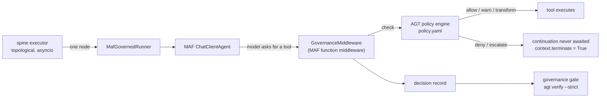

# Governance — Microsoft Agent Framework + Agent Governance Toolkit

> Workstream **L2**. Optional, off the default path, and detected — the spine
> ships a credential-free default for every seam and never depends on anything
> here.

This document explains one architectural decision, one integration seam, one
policy model, and how to turn it on.

---

## 1. MAF is not the orchestrator

The most common way to misuse Microsoft Agent Framework in a system like this is
to let it run the workflow. ADLC does not.

The task DAG is executed by the spine's own **topological asyncio executor**
(`PLAN.md` §1 idea 4, §3). That executor is credential-free, deterministic,
testable offline, and behaves identically in the CLI and in GitHub Actions. It
owns worktree isolation, level barriers, patch application and write-set
conflict detection. Those are framework invariants; they cannot live in an
optional preview dependency.

There are exactly two loops in ADLC:

| Loop | Owner | Why |
|---|---|---|
| Outer — event-driven CI | `github/gh-aw` | triggers, least-privilege execution, `safe-outputs`, network firewall |
| Inner — the task DAG | the spine's asyncio executor | credential-free, offline-testable, identical in CLI and Actions |

MAF is **not a third scheduler.** Its job here is exactly one thing:

> **Governed agent invocation** — a `ChatClientAgent` whose *function-calling
> middleware* is the seam where Agent Governance Toolkit enforcement runs before
> a tool call reaches the wire.

Concretely: if you delete `src/adlc/maf/**` the framework still runs every
stage, every gate and every acceptance test. What you lose is the ability to
prove that an agent's tool calls were policy-checked. That is the correct blast
radius for a public-preview dependency.



---

## 2. The middleware seam

MAF function middleware is an `async` callable that receives the pending
invocation and a continuation. **Not calling the continuation is what makes a
denied tool call structurally impossible** rather than merely discouraged:

```python
async def middleware(context: FunctionInvocationContext, call_next) -> None:
    decision = engine.check(context.function.name, context.arguments)
    if not decision.permits:
        return              # ← the tool never runs
    await call_next()
```

`adlc.maf.middleware.GovernanceMiddleware` is that, plus bookkeeping. On a
blocking verdict it sets `context.terminate = True` and puts the denial in
`context.result`, so the model observes an ordinary tool error and can explain
itself instead of the process crashing.

### Why *before*, not *around*

Prompt-level safety is a request, not a control. AGT's own framing — and
[OWASP LLM01:2025](https://genai.owasp.org/llmrisk/llm01-prompt-injection/) —
is that prompt injection has no known fool-proof mitigation. Deciding in
deterministic application code before the call is dispatched is the only
placement where a denial is a property of the system rather than of the model's
mood.

### Two AGT surfaces, probed in order

`PolicyEngine.load()` prefers the richer API because it yields a structured
verdict we can file as gate evidence:

1. **Agent Control Specification** — `agent_control_specification.AgentControl`,
   a stateless, fail-closed decision runtime. Verdicts are
   `allow | warn | deny | escalate | transform`.
2. **The `govern()` wrapper** — `agentmesh.governance.govern(tool, policy=...)`,
   which raises `GovernanceDenied`. Used as a *probe* against a no-op sentinel
   so the check still happens strictly before the real tool runs, and the real
   tool is executed exactly once, by MAF.

### Verdict mapping

| AGT verdict | Tool runs? | Rationale |
|---|---|---|
| `allow` | yes | |
| `warn` | yes | permitted, recorded |
| `transform` | yes, with rewritten arguments | the runtime sanitized the call |
| `deny` | **no** | |
| `escalate` | **no** | "a human has not approved this yet" is not permission |
| anything unrecognized | **no** | fail closed — see below |

`decision.permits` is treated as authoritative whenever the runtime supplies it,
and the name-based table is only the fallback. That way a vocabulary rename in a
future preview cannot silently flip a deny into an allow.

**Unparseable verdicts deny.** If AGT returns a shape we do not recognize, or
the policy engine raises, `check()` returns a deny whose reason says so. A
governance layer that errored has not authorized anything.

---

## 3. Verified API surface, and where these notes disagree with upstream

Both packages are **public preview**; both have already renamed things. Every
import in `adlc.maf` is deferred and probed rather than pinned. Verified against
the upstream repositories and PyPI on **2026-08-19**:

| Package | Version verified against | Notes |
|---|---|---|
| `agent-framework` (MAF) | **1.14.0** | AGT's own MAF examples pin `agent-framework==1.5.0` |
| `agent-governance-toolkit[full]` | **4.1.0** (meta) | pulls `-core` / `-cli` **5.0.0** |

Versions are pinned **here, not in `pyproject.toml`** — the `governance` extra
stays unpinned so a consumer can move at preview speed without a release of
this framework.

Corrections to the working notes this leaf was briefed with:

* **`ChatClientAgent` is the .NET name.** Python has exported the agent class as
  `Agent` (current `main`) and `ChatAgent` (earlier previews). The client
  keyword has alternated between `client` and `chat_client`.
  `adlc.maf.agents.resolve_agent_class()` therefore probes
  `ChatClientAgent → ChatAgent → Agent` and reads the client keyword off the
  constructor signature.
* **`AgentControl.from_path()` vs `from_manifest()`.** The AGT README shows
  `from_path`; the in-repo MAF examples use `from_manifest`. Both (and
  `from_file`) are attempted.
* **`HostSession(...).pre_tool_call(...)` is not universally present.** Where it
  exists it is preferred, because a pre-tool-call hook is exactly our seam.
  Otherwise we fall back to the stateless `runtime.evaluate("input", payload)`
  form shown in the README.
* **Middleware continuation arity changed.** Current MAF passes a zero-argument
  `call_next`; earlier previews passed `next(context)`. The middleware inspects
  the signature rather than guessing. Both are covered by tests.
* **AGT's Python distribution was consolidated in 4.1.0.** The governance
  modules live in `agent-governance-toolkit-core`, which is why the `[full]`
  extra is required; the bare wheel is the compliance CLI only. Importing
  `agent_os` emits a `DeprecationWarning`.

If an import path drifts again, fix the probe list in
`adlc/maf/middleware.py` and add a row above. Do not pin in `pyproject.toml`.

---

## 4. The policy model

`templates/.adlc/policy.yaml` is vendored to `.adlc/policy.yaml` by `adlc init`.
Resolution order is `$ADLC_POLICY` → `<repo>/.adlc/policy.yaml` → the shipped
template. **If none exists, governance is unavailable — never "allow".**

```yaml
apiVersion: governance.toolkit/v1
name: adlc-default
default_action: allow
rules:
  - name: block-destructive
    condition: "action.type in ['drop', 'delete', 'truncate']"
    action: deny
    description: "Destructive operations require human approval"
```

Rules are evaluated in order and the first match wins, so ordering is load
bearing: the network allowlist must precede the catch-all egress deny.

### Why `default_action: allow`

An SDLC agent makes hundreds of small legitimate reads and edits. A deny-by-
default policy for that workload needs an allowlist nobody can enumerate, and an
unenumerable allowlist becomes a rubber stamp that everyone widens until it
means nothing. So the default is `allow` and the **dangerous set is explicit and
closed**:

| Rule | Action | What it protects |
|---|---|---|
| `block-destructive` | deny | `drop` / `delete` / `truncate` / `destroy` / `purge` |
| `block-destructive-shell` | deny | `rm -rf`, `dd`, `mkfs`, `chmod 777`, `sudo` |
| `block-history-rewrite` | deny | force-push, `filter-branch` — audit history is append-only |
| `block-secret-exfiltration` | deny | `.env`, `.npmrc`, `id_rsa`, `~/.aws/credentials`, `~/.ssh/` |
| `require-approval-protected-paths` | require_approval | `adlc.ports.PROTECTED_PATHS` |
| `deny-write-outside-write-set` | deny | the node's declared `writeSet` (`PLAN.md` §4.3) |
| `allow-network-allowlist` | allow | GitHub API, PyPI, npm, crates.io, Go proxy |
| `block-network-egress` | deny | **everything else** — the anti-exfiltration control |
| `require-approval-subagent-spawn` | require_approval | bounded loops are a framework invariant |

Egress is the one place the policy *is* deny-by-default, because agent-authored
code runs untrusted (`PLAN.md` §4.8) and the allowlist mirrors the gh-aw
firewall.

`tests/l2_governance/test_policy_template.py` asserts that every entry in
`adlc.ports.PROTECTED_PATHS` is actually covered, so the policy cannot silently
drift away from the framework's own protected set.

Run `agt lint-policy .adlc/policy.yaml` after upgrading AGT. The `governance`
gate does this for you.

---

## 5. The `governance` gate

`adlc.adapters.gate.governance:GovernanceGate` — id `governance`,
`required_by_default = False`, required in the `full` profile.

```
agt verify --evidence runs/<run>/gates/governance-evidence.json --strict
agt lint-policy .adlc/policy.yaml
```

Outputs, written into `runs/<run>/gates/`:

| File | Written by |
|---|---|
| `governance.json` | the gate — the `GateResult` itself |
| `governance-evidence.json` | `agt verify --evidence` — AGT's attestation |
| `governance-decisions.json` | `MafGovernedRunner` — the middleware decision log |

### Status mapping

| Condition | Status |
|---|---|
| `agt` not on PATH, or no policy | `not_run` |
| `agt verify` or `agt lint-policy` timed out or could not be spawned | `not_run` |
| `agt lint-policy` exited non-zero | `fail` (the policy itself is broken) |
| `agt verify --strict` exited non-zero | `fail` |
| any tool call was blocked during the run | `fail` |
| verify and lint both clean, no denials | `pass` |

"Did not run" outranks "ran and failed", because `not_run` is a statement about
our own confidence rather than about the repository.

> **`not_run` is honest here.** There is no code path in this gate that reports
> `pass` for a check that did not execute. A required gate returning `not_run`
> is turned into a build failure by the aggregator (`PLAN.md` §4.2), which is
> the intended behaviour — fail closed.

---

## 6. The `maf` agent runner

`adlc.adapters.agents.maf_governed:MafGovernedRunner`, entry point `maf`.

Same frozen `AgentRunner` contract as every other runner: one node, one isolated
worktree, a patch anchored to that worktree's base SHA, and no writes outside
`node['writeSet']`. Governance adds:

1. Tools are confined to the worktree and to the write set *in code*, as defence
   in depth behind the policy — a policy misconfiguration still cannot escape.
2. Every tool call goes through `GovernanceMiddleware` first.
3. After the run, the working tree is re-checked against the write set and
   `PROTECTED_PATHS`; a violation resets the worktree and fails the node.
4. If **any** call was blocked, the node fails. An agent that had to be stopped
   did not complete its task.
5. If MAF or AGT is unavailable, `run_task` **fails** rather than running
   ungoverned.

The `AgentRunner` signature carries no run id, so the runner reads
`ADLC_RUN_DIR` or `ADLC_RUN_ID` to place `patches/<node>.patch` and the decision
log; it falls back to `.adlc/runs/current/`.

---

## 7. Enabling it

```bash
pip install "adlc[governance]"        # agent-framework + agent-governance-toolkit[full]
agt doctor                            # confirm the CLI is wired up
adlc doctor --json                    # confirm ADLC detected both
```

Vendor the policy and select the runner:

```yaml
# .adlc/config.yaml
profile: full
adapters:
  agents: maf
gates:
  required: [tests, secrets_local, deps_local, evidence_completeness, governance]
```

A model endpoint is required for the runner (not for the gate). One of:

| Variable | Client |
|---|---|
| `AZURE_AI_PROJECT_ENDPOINT` | `agent_framework.foundry.FoundryChatClient` |
| `AZURE_OPENAI_ENDPOINT` | `agent_framework.azure.AzureOpenAIChatClient` |
| `OPENAI_API_KEY` | `agent_framework.openai.OpenAIChatClient` |
| `ADLC_MAF_CHAT_CLIENT` | `module:factory` escape hatch for hosts that build their own |

Other knobs: `ADLC_POLICY` (policy path override),
`ADLC_GOVERNANCE_TIMEOUT` (seconds for each `agt` invocation, default 180).

### Detection

`detect()` for every component is cheap, non-raising, network-free and
subprocess-free — module-finder probes, a `PATH` lookup and a `stat`. Each
returns a specific reason that is surfaced verbatim in `capabilities.json` and
in any `not_run` gate:

```
agent_framework not installed — pip install "adlc[governance]"
agent-governance-toolkit not installed — pip install "adlc[governance]"
agt CLI not on PATH — pip install "adlc[governance]"
no AGT policy found — expected .adlc/policy.yaml
no MAF chat client configured — set one of AZURE_AI_PROJECT_ENDPOINT, ...
```

---

## 8. Tests

```bash
python -m pytest tests/l2_governance -q
ruff check src/adlc/maf src/adlc/adapters/gate/governance.py
```

The suite runs with **no credentials** and with **neither preview package
installed**, and passes either way — it never asserts that an import fails, only
that the contract holds. It covers the degradation path, verdict normalization
across every AGT result shape (including the fail-closed unknown-shape case),
the MAF seam under both continuation arities, gate status mapping with a mocked
`agt`, write-set and protected-path enforcement against a real temporary git
repo, and the structural claims the policy template makes.
