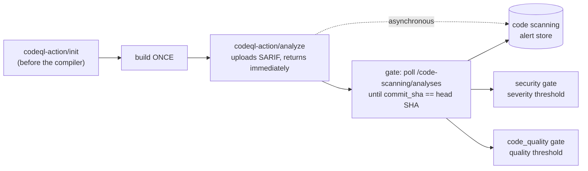

# GitHub security & code quality gates (L4)

Three optional gate adapters that read GitHub's security and quality data:

| Gate id | Class | Module | Required by default |
|---|---|---|---|
| `security` | `CodeQlGate` | `adlc/adapters/gate/codeql.py` | yes (in the `full` profile) |
| `code_quality` | `CodeQualityGate` | `adlc/adapters/gate/code_quality.py` | yes (in the `full` profile) |
| `dependency` | `DependencyReviewGate` | `adlc/adapters/gate/dependency.py` | **no** — advisory |

All three are **pure additions**. With no `GITHUB_TOKEN` / `GITHUB_REPOSITORY` they
report `detect() -> (False, reason)` and the spine's credential-free gates
(`secrets_local`, `deps_local`, `tests`, `evidence_completeness`) carry the run.
Nothing here can break the credential-free conformance suite.

---

## 1. The ordering problem, and why "security first" is fiction

A naive pipeline says *"run security scanning, then build"*. CodeQL's lifecycle
makes that impossible. `github/codeql-action/init` must run **before**
compilation so it can intercept the compiler and build a database;
`github/codeql-action/analyze` must run **after** it. There is exactly one build,
and security analysis wraps around it:



Duplicating the build to "scan first" doubles CI cost and, worse, scans a
different artifact than the one you ship.

### 1.1 The stale-alert false green

`analyze` uploads a SARIF file and returns. The alerts derived from it are **not
immediately queryable**. A gate that calls `GET /code-scanning/alerts` right
after `analyze` is very likely to be served the alert set from a *previous*
analysis — typically the last default-branch scan, which is usually clean.

That is a **false green**: the gate reports "no findings" for a commit that was
never actually analysed. This is the single most dangerous failure mode in this
area, because it fails *open* and looks exactly like success.

The mitigation is to never trust "the latest alerts for the repo". Instead:

1. `GET /repos/{owner}/{repo}/code-scanning/analyses?ref=…&tool_name=CodeQL`
2. Scan the response for an analysis whose **`commit_sha` equals the exact head
   SHA under test**, optionally further pinned by `ref`, `category` and
   `analysis_key` so another workflow's analysis of the same commit cannot
   satisfy the gate.
3. Only once that analysis exists, `GET /code-scanning/alerts?ref=…&state=open`
   scoped to the ref of the analysis that was actually matched.

`find_matching_analysis()` implements step 2 and is deliberately strict:

* exact, case-insensitive, full-string equality on `commit_sha`;
* **no prefix matching** — an abbreviated SHA never matches, because a short SHA
  is ambiguous;
* **no "fall back to the most recent analysis"** — that is precisely the bug.

> **API note (verified).** `GET /repos/{owner}/{repo}/code-scanning/analyses` has
> **no `sha` query parameter**. Supported filters are `tool_name`, `tool_guid`,
> `ref`, `sarif_id`, `pr`, `page`, `per_page`, `direction`, `sort`. The commit
> match therefore *must* be done client-side against each analysis's `commit_sha`
> field. `ref` is passed only to bound how much we page through.

### 1.2 Why alerts are not filtered on the instance SHA

Each alert carries `most_recent_instance.commit_sha`. It is tempting to filter
the blocking set on it. **Do not.** For a pull request analysed on
`refs/pull/N/merge`, that value is the *merge* commit, not the PR head SHA, so
filtering on it silently drops every real finding — another false green.

The gate reports the count as `observed.atSha` for transparency but applies the
threshold to the full ref-scoped set. Erring toward the larger set fails closed.

---

## 2. Fail-closed timeout behaviour

Because uploads are asynchronous, "I did not see an analysis for this commit" and
"this commit has no findings" are indistinguishable from outside. Only one of
those readings is safe.

**On timeout the gate returns `status: "not_run"` with a reason. It never returns
`pass`.** Per `docs/PLAN.md` §4.2, `required: true` + `not_run` ⇒ the aggregate
check FAILS, so a timeout on a required gate turns into a red build.

The same rule covers every other degraded path:

| Situation | Result |
|---|---|
| No `GITHUB_TOKEN` / `GITHUB_REPOSITORY` | `not_run` (spine's local gates take over) |
| `run.headSha` empty — nothing to pin to | `not_run` |
| Analysis for the head SHA never appears within `timeoutSeconds` | `not_run` |
| Only *other commits'* analyses are returned, forever | `not_run` |
| Analysis found, but reading alerts fails (e.g. 403 GHAS off) | `not_run` |
| Transport errors / unexpected exceptions while polling | retried, then `not_run` |
| Code Quality not enabled in Settings | `not_run` |
| Alert/finding result set truncated **and otherwise clean** | `not_run` |
| Alert/finding result set truncated **but a breach was seen** | `fail` (sound regardless) |
| Dependency review + Dependabot both unreadable | `not_run` |
| Diff changed no dependencies at all | `pass` — genuinely nothing to audit |

Transport errors are retried rather than raised, because a flaky API is
indistinguishable from a slow one — and both must end in a timeout, not a silent
success. `tests/l4_security/test_poll_timeout.py` asserts this property
explicitly, including that a timeout is `not_run` and never `pass`.

### 2.1 Only pass what was actually verified

This mirrors the discipline in the spine's `deps_local` gate, which carefully
separates **"no manifests, so nothing to audit" → `pass`** from **"manifests
exist but no auditor" → `not_run`**. The same split applies here:

* *"This diff changed no dependencies"* is a real `pass` — the check ran and
  found nothing to flag.
* *"The alert list came back truncated"* is **not** a pass, even when the part we
  saw was clean, because a clean sample drawn from a partial result set proves
  nothing. Both the `security` and `code_quality` gates detect result-set
  truncation and fail closed. A threshold breach found *within* a truncated
  sample still fails normally — that conclusion is sound either way.

---

## 3. GitHub Code Quality

GitHub Code Quality reached GA on **2026-07-20**. It is a **distinct product**
from code scanning, delivered through CodeQL's `code-quality` analysis kind.

### 3.1 It is enabled in Settings — a workflow cannot self-enable it

Code Quality is turned on at **repository Settings → Security → Code quality**,
or granted org-wide at Organization Settings → Security → Code quality →
Repository access (an enterprise owner must allow it at the enterprise level
first). **No workflow file can enable it.**

The gate therefore **preflights** and never pretends to enable anything:

```
GET /repos/{owner}/{repo}/code-quality/setup
  → 200 {"state": "configured"}      → proceed
  → 200 {"state": "not-configured"}  → not_run
  → 403 / 404 / 503                  → not_run
```

When it is off, the gate returns exactly:

> Code Quality not enabled in repository settings — enable at Settings → Security → Code quality

`GET /code-quality/setup` returns HTTP **200 with `state: "not-configured"`** for
a licensed-but-unconfigured repo, so a 200 alone is not permission to proceed —
the `state` field must be checked.

**Honest limitation on error mapping.** The API documents a single `403`
("*not authorized to access Code quality for this repository*") for **both**
"Code Quality is not licensed for this org" **and** "the token lacks
permission", and a bare `404` ("*Resource not found*") for both "no such repo"
and "the token cannot see this repo". These genuinely cannot be told apart from
the response. The gate's reason strings say so rather than guessing — it will not
claim "not enabled" when the real cause may have been a bad token.

### 3.2 The `analysis-kinds` input is `[Internal]`

For advanced setup, Code Quality is exposed via `github/codeql-action/init`:

```yaml
- uses: github/codeql-action/init@v4
  with:
    languages: python
    analysis-kinds: code-scanning,code-quality
```

The action's own `action.yml` describes this input as:

> **[Internal]** A comma-separated list of analysis kinds to enable. This input is
> intended for internal-use only at this time and the behaviour is subject to
> changes. Some features may not be available depending on which analysis kinds
> are enabled.

Also documented there: `code-quality` "must be enabled in conjunction with
`code-scanning`" — it is not valid on its own — and the input defaults to
`code-scanning`.

**Treat it as best-effort.** It is an officially unsupported interface that may
change or disappear without notice. The supported enablement path is Settings;
when Code Quality is enabled that way, GitHub injects the configuration
server-side. Nothing in this workstream depends on the input being set.

### 3.3 Can Code Quality findings be told apart from security alerts?

This was investigated specifically. The answer has two halves.

**Within the `/code-quality/` namespace: yes, cleanly.** Code Quality has its own
REST endpoints — `GET /repos/{o}/{r}/code-quality/findings`,
`/code-quality/findings/{n}`, and `/code-quality/setup`. A finding object carries
`rule.category`, an enum of `none | maintainability | reliability`. **That field
does not exist in the code scanning alert schema**, so it is an unambiguous
discriminator — but only for objects fetched from this namespace.

**Within `/code-scanning/alerts`: no, not cleanly.** Concretely:

* There is **no `kind`, `analysis_kind`, `type` or `category` field** on the alert
  object or its `rule` object. The documented `rule` fields are exactly `id`,
  `name`, `severity`, `security_severity_level`, `description`,
  `full_description`, `tags`, `help`, `help_uri`. (An `analysis_kind` field is
  sometimes claimed to exist; it is **not** in the published schema. Do not rely
  on it.)
* There is **no `analysis_kind`/`kind` query parameter** to filter by.
* `rule.tags` **does** exist (`array of string | null`), and in practice security
  queries carry tags like `security` and `external/cwe/cwe-089` while quality
  queries carry tags like `maintainability` / `reliability`. **However, the REST
  API contract does not enumerate these values.** Using tags as a discriminator
  relies on de-facto behaviour, not a specification guarantee.
* `rule.security_severity_level` is `null` for non-security rules, which makes
  `security_severity_level == null` a reasonable *proxy* for "not a security
  rule". This is an inference from documented semantics, not an explicit flag.
* Whether `tool.name` differs for Code Quality uploads is **unverified**.
* Whether *every* code quality finding is also mirrored into
  `/code-scanning/alerts` is **not stated in the documentation** — an open gap.

**How this codebase handles it.** The `security` gate buckets alerts with no
`security_severity_level` under `observed.bySeverity.unknown` and never invents a
security band for them. Since the default threshold blocks only `critical` and
`high`, quality alerts leaking into the code-scanning feed cannot cause a
spurious security failure. The `code_quality` gate reads the dedicated
`/code-quality/findings` endpoint and uses `rule.category`, so it never has to
guess.

### 3.4 Code Quality findings cannot be pinned to a commit

This is a real limitation, documented here rather than hidden.

`GET /repos/{o}/{r}/code-quality/findings` accepts only `state`, `direction`,
`per_page`, `before` and `after`. There is **no `ref`, `pr`, `sha` or
`commit_sha` parameter**, and a finding object contains **no `commit_sha`, `ref`,
`analysis_key` or `most_recent_instance`** — no commit linkage of any kind. The
endpoint is a point-in-time snapshot of the findings store. There is no
documented way to ask "what were the findings as of commit X".

On its own, that reintroduces exactly the stale-result problem from §1.1.

**Mitigation.** Because Code Quality is produced by the *same* CodeQL run, the
gate first requires a CodeQL analysis for the **exact head SHA** to have
completed — reusing the same `poll_for_analysis()` machinery as the `security`
gate — and only then snapshots the findings. That proves a fresh analysis of this
commit finished before the snapshot was taken.

This is **corroboration, not proof**. The residual gap is recorded in every
result under `observed.provenanceNote`. Set
`gates.code_quality.requireAnalysisAtHeadSha: false` to accept an unpinned
snapshot, understanding the tradeoff.

**Pagination.** `/code-quality/findings` uses cursor pagination via the `Link`
header, which the stdlib client here does not read. One page is fetched; if it
comes back full, the result set may be truncated, and a clean sample cannot prove
a clean repo. Rather than risk an undercount the gate returns `not_run`. A
threshold breach found *within* the sample still fails normally, since that
conclusion is sound regardless of truncation.

---

## 4. Dependency gate

Two APIs answer different questions:

* `GET /repos/{o}/{r}/dependency-graph/compare/{base}...{head}` — **dependency
  review**. Diff-scoped: which dependencies this change *adds*, and the
  advisories affecting them. This is the honest "new risk" signal, and it is what
  the gate prefers. Needs `contents: read`.
* `GET /repos/{o}/{r}/dependabot/alerts` — repo-scoped standing alerts. Answers
  "is this repo vulnerable?", not "did this PR make it worse". Used only as a
  fallback, and the result discloses the wider scope in `observed.notes`.

Only `change_type: "added"` entries count. Counting `removed` entries would fail a
PR for *fixing* a vulnerability.

**Severity vocabularies differ**: dependency review reports `moderate` where
Dependabot reports `medium`. `normalize_severity()` folds them into one scale
(`critical | high | medium | low`).

This gate is `required_by_default = False`. The spine's credential-free
`deps_local` gate (`pip-audit` / `npm audit`) remains the required one; this adds
GitHub advisory data on top.

---

## 5. Required permissions

In a workflow, grant the **minimum** for each job (see `docs/PLAN.md` §4.8):

```yaml
# The job that runs codeql init → build → analyze
permissions:
  contents: read
  security-events: write     # required to UPLOAD SARIF / create analyses

# The job that runs `adlc gate`
permissions:
  contents: read             # dependency review compare API
  security-events: read      # read code scanning alerts and analyses
```

| Operation | Permission / scope |
|---|---|
| Upload SARIF, create analyses (`analyze`) | `security-events: write` (`security_events` scope) |
| Read code scanning alerts and analyses | `security-events: read` (`security_events`; `public_repo` suffices on public repos) |
| Dependency review compare | `contents: read` |
| Dependabot alerts | `security-events: read` |
| Code Quality `setup` and `findings` | `repo` scope (**not** `security_events`) |

Note the inconsistency in the last row: the `/code-quality/` endpoints are
documented against the `repo` scope, unlike the code scanning endpoints. In a
fine-grained/Actions token, `contents: read` is the closest equivalent.

The gates read `GITHUB_TOKEN`, falling back to `GH_TOKEN`, and honour
`GITHUB_API_URL` for GitHub Enterprise Server.

---

## 6. These features are not free everywhere

**Do not assume any of this is available.** That is why all three adapters are
optional and degrade to `not_run`.

* **Code scanning / CodeQL.** Free for **public** repositories. On **private**
  repositories it requires GitHub Advanced Security (GitHub Code Security). The
  REST endpoints return `403` — *"GitHub Advanced Security is not enabled for
  this repository"* — when it is not licensed.
* **GitHub Code Quality.** A **standalone paid product**, explicitly *not*
  bundled with Advanced Security. Priced per active committer per month, plus
  usage-based AI credits and Actions compute. Available on GitHub Enterprise
  Cloud and GitHub Team; **not available on GitHub Enterprise Server** as of GA.
  GHAS is not required, but a Code Quality licence is.
* **Dependabot alerts / dependency review.** Free on public repositories;
  dependency review on private repositories requires Advanced Security.
* **Actions minutes.** CodeQL analysis consumes them on private repositories.

Because of all this, `security` and `code_quality` are required only in the
`full` profile. The default `minimal` profile requires only the credential-free
spine gates, so `adlc` works out of the box on a free private repo.

---

## 7. Configuration

All options live under `gates.<gate_id>` in `.adlc/config.yaml`. Every one has a
working default; the block below is entirely optional.

```yaml
gates:
  security:
    timeoutSeconds: 900          # fail closed after this long. Default 900.
    pollIntervalSeconds: 10      # Default 10.
    maxBySeverity:               # Default: zero critical, zero high.
      critical: 0
      high: 0
    ref: refs/pull/42/merge      # Default: $GITHUB_REF, else refs/pull/<n>/merge.
    category: null               # Pin to one codeql-action `category`.
    analysisKey: null            # Pin to one workflow, e.g. ".github/workflows/codeql.yml".
    toolName: CodeQL

  code_quality:
    timeoutSeconds: 900
    requireAnalysisAtHeadSha: true   # See §3.4. Turning this off accepts an unpinned snapshot.
    maxFindings: 100                 # One page; a full page fails closed.
    maxBySeverity:                   # rule.severity: error|warning|note|none
      error: 0

  dependency:
    maxBySeverity:
      critical: 0
      high: 0
    allowDependabotFallback: true    # Fall back to repo-scoped alerts. Default true.
```

Severity vocabularies, so the thresholds are unambiguous:

| Field | Values | Applies to |
|---|---|---|
| `rule.security_severity_level` | `critical, high, medium, low` | code scanning **security** alerts only; `null` otherwise |
| `rule.severity` | `error, warning, note, none` | **all** code scanning alerts, and all code quality findings |
| dependency review `severity` | `critical, high, moderate, low` | `moderate` is normalised to `medium` |
| Dependabot `severity` | `critical, high, medium, low` | |

The `security` gate's threshold is expressed in `security_severity_level`; the
`code_quality` gate's in `rule.severity`, since quality findings have no security
severity.

---

## 8. What each gate writes

Every result follows the frozen `GateResult` shape from `adlc.ports` and cites
`gates/<gate_id>.json` as evidence. `observed` always carries enough to audit the
verdict without re-running it — for `security`: the analysis id, the matched
`commit_sha`, counts in both severity vocabularies, the poll attempt count and
elapsed time, truncation state, and any transport errors.

**These gates never write `run.json`.** They return a `GateResult`; the spine's
`adlc.stages.gates.run_gates` persists it with `write_gate()`, and only
`adlc reduce` folds gate files into `run.json`. That is what keeps parallel
Actions jobs race-free.

Note the division of labour with the executor: `run_gates` calls `detect()`
itself and turns an unavailable or raising gate into `not_run` before
`evaluate()` is ever reached, and it re-stamps `required` from the profile. Each
gate here still re-checks `detect()` inside `evaluate()` so it is also correct
when called directly, e.g. from a test or another tool.

The `gateResult` schema in `schemas/adlc-run.schema.json` is
`additionalProperties: false`, so results carry exactly `id`, `required`,
`status`, `severity`, `observed`, `expected`, `message`, `evidence` and nothing
else. `tests/l4_security/test_spine_integration.py` validates every reachable
outcome of all three gates against the real schema.

---

## 9. Verifying this workstream

```bash
python -m pytest tests/l4_security -q
ruff check src/adlc/adapters/gate/
```

The tests are hermetic: `tests/l4_security/conftest.py` scrubs `GITHUB_TOKEN`,
`GH_TOKEN`, `GITHUB_REPOSITORY`, `GITHUB_REF` and `GITHUB_API_URL` from the
environment for every test, so they pass identically on a developer laptop with
credentials exported and on a bare CI runner. No test performs any network I/O;
recorded fixtures in `tests/l4_security/fixtures/` stand in for the REST API, and
polling runs against an injected fake clock so the timeout tests are instant and
deterministic.

`test_spine_integration.py` additionally drives all three gates through the real
`adlc.stages.gates.run_gates` executor to confirm that, with no credentials, they
degrade to `not_run`, that required + `not_run` fails the aggregate, and that
every emitted result validates against `schemas/adlc-run.schema.json`.

---

## References

* Code scanning REST API — <https://docs.github.com/en/rest/code-scanning/code-scanning>
* Code Quality REST API — <https://docs.github.com/en/rest/code-quality/code-quality>
* Enabling Code Quality — <https://docs.github.com/en/code-security/how-tos/maintain-quality-code/enable-code-quality>
* Alert severity vs security severity — <https://docs.github.com/en/code-security/concepts/code-scanning/code-scanning-alerts>
* `analysis-kinds` input — <https://github.com/github/codeql-action/blob/main/init/action.yml>
* Code Quality GA changelog — <https://github.blog/changelog/2026-07-20-github-code-quality-is-now-generally-available/>
* Dependency review API — <https://docs.github.com/en/rest/dependency-graph/dependency-review>
* Dependabot alerts API — <https://docs.github.com/en/rest/dependabot/alerts>
