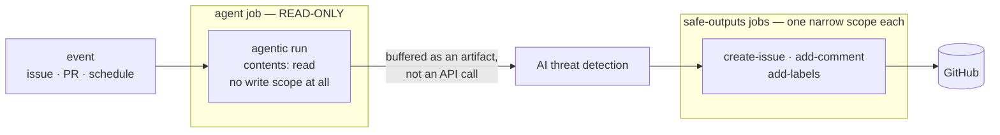
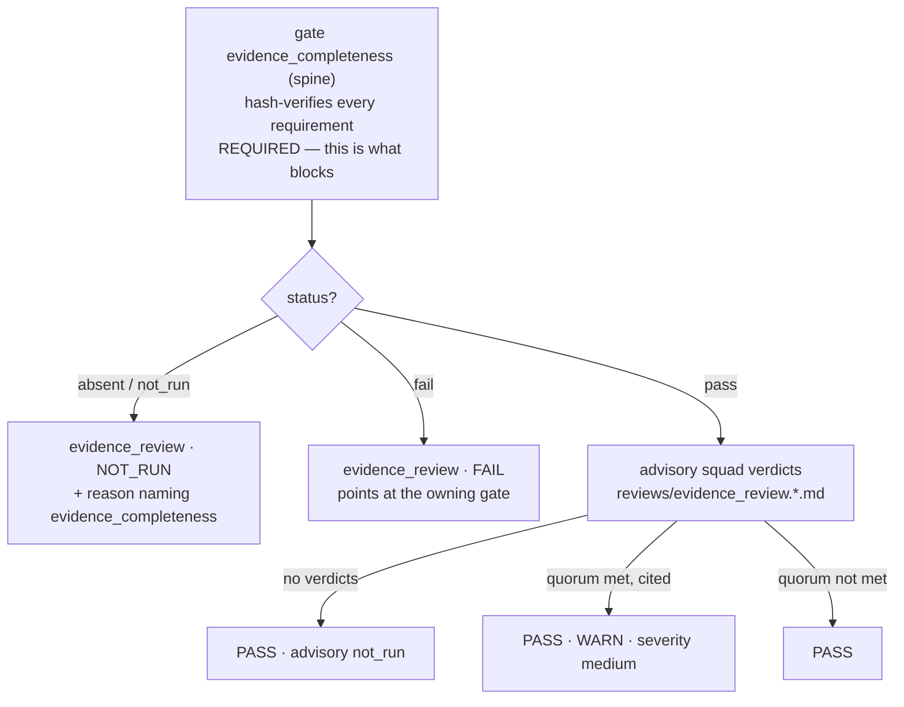

# Reviewer squads (L8)

> GitHub Agentic Workflows (`gh-aw`) + three `GateRunner`s.
> Sources: `.github/workflows/adlc-*.md` · compiled: `.github/workflows/adlc-*.lock.yml`
> Members: `.github/agents/*.agent.md` · config: `templates/.adlc/squads.yaml`
> Gates: `src/adlc/adapters/gate/{adversarial_review,evidence_review,feature_completeness}.py`

This workstream adds the three *judgement* seams of the ADLC — an adversarial
code review squad, an evidence review squad, and a code-blind
feature-completeness squad — plus the two outer-loop workflows that feed the
pipeline (`autoresearch`, `intake`).

The three sit at different distances from the change, and that distance is the
design:

| Squad | Sees | Asks |
|---|---|---|
| `adversarial_review` | the diff | How does *this change* break? |
| `evidence_review` | the evidence pack | Does the evidence back each requirement? |
| `feature_completeness` | the evidence pack, and nothing else — no code, no sessions, no reasoning | Did we demonstrate the thing that was asked for? |

Everything here is a **pure addition**. All three gates are `required_by_default
= False`, all three `detect()` cheaply and honestly, and all three report
`not_run` with a specific reason when they have nothing to score. Nothing in this
leaf can break the credential-free conformance suite.


---

## 1. Toolchain

Workflows are **Markdown files with YAML frontmatter** in `.github/workflows/`,
compiled by [`github/gh-aw`](https://github.com/github/gh-aw) into hardened
GitHub Actions files:

```bash
gh extension install github/gh-aw     # note: moved from githubnext/gh-aw
gh aw compile                         # .md -> .lock.yml
```

**Both the `.md` source and the generated `.lock.yml` are committed.** The lock
file is what GitHub actually runs; the Markdown is what humans review.

Verified against **gh-aw v0.86.2** and the frontmatter schema at
<https://github.github.com/gh-aw/>. Corrections to older guidance you may find
elsewhere, all confirmed against `pkg/parser/schemas/main_workflow_schema.json`
at the pinned tag:

| Stale | Current |
|---|---|
| `tools: { edit-file: false }` | the key is **`edit`** (boolean) |
| `tools: { bash: { allowed: [...] } }` | `bash` takes a **bare array**: `bash: ["cat *", "jq *"]` |
| `tools: { web-fetch: false }` | `web-fetch`/`web-search` accept **null or object only** — *omit* them to disable |
| `strict: true` must be set | `strict` already **defaults to `true`**; we set it explicitly anyway |
| `engine: { model: ... }`, `engine: { max-turns: ... }` | both **deprecated** — use top-level `model:` / `max-turns:` |
| `github: { mode: remote }` | still valid; `gh-proxy` is now the preferred mode |

`github.toolsets` is drawn from a fixed enum (`issues`, `repos`,
`pull_requests`, `actions`, `code_security`, …). That enum is the whole basis of
the evidence squad's sandbox — see §4.

### Three things the spine should own

1. **`.gitattributes` and `.github/aw/actions-lock.json`.** `gh aw compile`
   creates both: the first adds
   `.github/workflows/*.lock.yml linguist-generated=true`, which collapses the
   ~110 KB lock diffs in review; the second is a compile-time cache of resolved
   action SHAs. Both sit outside this workstream's exclusive paths, so they are
   deliberately **not** committed here. Neither is needed at runtime — the
   `.lock.yml` files already carry every action pinned to a full SHA inline. The
   spine should adopt both, and add a `.gitignore` covering `__pycache__/` and
   `.venv*/`.
2. **A repo-root `conftest.py` that prepends `src/`.** See §9: parallel
   worktrees share one editable install, so any suite can silently end up
   testing a sibling's code. One three-line root conftest fixes it for all ten
   leaves at once.
3. **The `evidence-review-pack` artifact.** `adlc-evidence-review.md` downloads
   an artifact named `evidence-review-pack` containing
   `evidence-review-pack.json` from the most recent completed workflow run named
   `ADLC` — which is `adlc.yml`, the spine-owned reusable workflow — for the
   PR's head SHA. `adlc.yml` currently uploads the whole run directory as
   `adlc-<run-id>`; it needs to additionally publish the pack under that fixed
   name, or this workflow degrades to `not_run`. Symmetrically, the spine needs
   to unpack the `adlc-reviews-adversarial` artifact into `runs/<run>/reviews/`
   and harvest the evidence squad's PR comment into
   `runs/<run>/reviews/evidence_review.requirements-auditor.md`.

---

## 2. The safe-outputs security model

This is the whole security story, and it is worth stating plainly because it is
what makes it acceptable to point a language model at a repository at all.



The agent job **never** holds a write permission. When the agent wants to create
an issue or post a comment, it calls an MCP tool that *buffers a structured
request* into an artifact. A separate job — with exactly one narrow write scope,
after an AI threat-detection pass — performs the actual API call.

Consequences that matter:

- A prompt injection that convinces the agent to "push a commit" achieves
  nothing, because the token in that job cannot push.
- Every write is **capped and allowlisted at compile time**: `max: 1` issue,
  `max: 1` comment, `allowed: [...]` labels. A compromised agent cannot spam.
- Every write is **auditable**: the buffered request survives as an artifact.

Every workflow in this leaf declares `permissions:` with `read` values only, and
`tests/l8_squads/test_workflows.py::TestEveryWorkflow::test_agent_job_holds_no_write_permission`
fails the build if anyone ever changes that.

### Cost caps

Every workflow sets all three. `test_every_cost_cap_is_set` enforces it.

| Workflow | `timeout-minutes` | `max-turns` | `max-ai-credits` |
|---|---|---|---|
| `adlc-autoresearch` | 20 | 40 | 400 |
| `adlc-intake` | 15 | 25 | 250 |
| `adlc-adversarial` | 30 | 90 | 900 |
| `adlc-evidence-review` | 20 | 30 | 300 |
| `adlc-feature-completeness` | 25 | 45 | 450 |

`network:` is an explicit firewall allowlist on all five (`allowed: [defaults]`),
never a bare `*` — which `strict: true` rejects anyway.

---

## 3. The workflows

### 3.1 `adlc-autoresearch.md` — propose the next run

`schedule: weekly on monday` + `workflow_dispatch`. Reasons over three inputs:
repository knowledge (including `docs/decisions/` ADRs), past run outcomes in
`.adlc/runs/*/run.json`, and historical human feedback (closed `adlc:brief`
issues and the review comments on their PRs).

Emits **at most one** issue:

```yaml
safe-outputs:
  create-issue:
    max: 1
    title-prefix: "[adlc:brief] "
    labels: [adlc:brief, adlc:autoresearch]
    close-older-issues: true
    close-older-key: adlc-autoresearch-brief
    deduplicate-by-title: 2      # tolerate two-character title drift
```

The prompt is explicit that **proposing nothing is a successful cycle**, and
lists hard negative signals (duplicates, "add more tests", anything touching the
`PROTECTED_PATHS` from `adlc.ports`). An outer loop that manufactures work to
look busy is worse than no outer loop.

### 3.2 `adlc-intake.md` — qualify and categorise

Triggers on `issues: [opened, labeled, reopened]`, filtered by
`if: contains(github.event.issue.labels.*.name, 'adlc:brief')`.

Scores the brief out of 100 across five dimensions (problem is real, outcome is
falsifiable, scope is bounded, ACs are checkable, evidence is producible)
against `qualify.minScore` from `.adlc/config.yaml`, then posts one comment and
applies allowlisted labels (`adlc:qualified` / `adlc:needs-detail` /
`adlc:rejected`, a `kind`, and `adlc:route-inner` / `adlc:route-outer`).

> **Known GitHub limitation.** Issues created by `autoresearch` through
> safe-outputs are authored by `github-actions[bot]` using `GITHUB_TOKEN`, and
> GitHub deliberately does **not** re-trigger workflows from `GITHUB_TOKEN`
> events. So autoresearch → intake does not chain automatically. Either label
> the issue by hand, or give `create-issue` a `github-app:` credential. This is
> a platform behaviour, not a bug in these workflows.

### 3.3 `adlc-adversarial.md` — the adversarial code squad

`pull_request: [opened, synchronize, reopened, ready_for_review]`. Checks out the
repo (it *is* the code reviewer), establishes the diff against the merge base,
loads `squads.adversarial_review.members[]` from `.adlc/squads.yaml`, and runs
each member's `.github/agents/*.agent.md` profile as a separate, independent
pass.

Each pass writes `$ADLC_REVIEW_DIR/adversarial_review.<member-id>.md`. A
deterministic `post-steps` uploads them as the `adlc-reviews-adversarial`
artifact, which the spine drops into `runs/<run>/reviews/` for the gate.

`edit: true` is set here — and *only* here — because the squad has to stage its
verdict files. The job still holds `contents: read`, nothing is pushed, and the
only channels off the runner are safe-outputs and that artifact.

### 3.4 `adlc-evidence-review.md` — the evidence squad

See §4. This is the one that matters.

### 3.5 `adlc-feature-completeness.md` — the code-blind completeness squad

The last question in the lifecycle, and the only one asked from entirely outside
it: *having built and gated all of that, did we demonstrate the thing that was
asked for?*

It reuses §4's sandbox verbatim — `checkout: false`, `toolsets: [issues]`,
`read-only: true`, no web tools, a trivial `bash` allowlist, one `add-comment`
— and adds one exclusion the evidence squad does not need (§4.3). Its input is
`completeness-pack.json`, not `evidence-review-pack.json`, and unlike the
evidence squad **its verdict blocks** (§8.3).

---

## 4. Why the evidence squad's sandbox is structural, not prompt-based

### 4.1 The argument

You can write "do not read the source code" in a system prompt. That is a
*request to a language model*. It is not a control. It can be argued with,
confused, out-competed by a later instruction, or subverted by content the model
reads along the way — and you will not find out, because a model that ignored
the instruction produces output that looks exactly like a model that obeyed it.

The evidence squad's value depends entirely on it **not** having seen the
implementation. A reviewer who has read the diff will rationalise the evidence
to match the code; that is what reviewers do. So the isolation cannot be a
promise. It has to be a property of the job.

So: **the reviewer does not read the source because the source is not there.**

```yaml
checkout: false           # no source tree on the runner, at all
tools:
  github:
    mode: remote
    toolsets: [issues]    # no `repos` toolset => no file-read tool
    read-only: true
  bash: ["cat *", "jq *", "head *", "wc *"]
  edit: false
# web-fetch / web-search are opt-in and simply not requested
```

Each line is a distinct control, in descending order of load:

| Control | What it removes | Verified by |
|---|---|---|
| `checkout: false` | The entire source tree. The compiled `agent` job contains **zero** `actions/checkout` steps. `cat` has nothing to read; `grep` has nothing to search. | `test_compiled_agent_job_contains_no_checkout_step` |
| `toolsets: [issues]` | The MCP path back to the code. Without `repos` there is no `get_file_contents`, no blob read, no tree listing. The compiled job starts the server with `"X-MCP-Toolsets": "issues"`. | `test_compiled_mcp_server_is_scoped_to_issues` |
| `read-only: true` | Writes even within `issues`. | `test_github_access_is_read_only_issues` |
| no `web-fetch` / `web-search` | HTTP as a way to re-fetch the repo. Second layer: the `network:` firewall allowlist. | `test_no_web_access_is_requested` |
| trivial `bash` | `git`, `curl`, `wget`, `find`, `python`, `node`, `gh` — every command that could reach code or exfiltrate. | `test_compiled_shell_allowlist_excludes_every_egress_command` |
| one `add-comment`, `max: 1` | Every other write path. No `upload-artifact`, no `create-pull-request`. | `test_the_only_write_path_is_one_comment` |

These are assertions against the **compiled `.lock.yml`**, not against the
Markdown. What GitHub runs is what is tested.

> **One honest caveat.** gh-aw v0.86 still grants the Copilot harness its own
> `write` tool regardless of `edit: false`, for its own scratch output. So
> `edit: false` is a declaration of intent rather than a hard block. It does not
> weaken anything here, because with no checkout there is nothing to overwrite
> and no push path — which is precisely why the sandbox is built on
> `checkout: false` first and everything else as depth. Do not restructure this
> workflow to depend on `edit: false` as a boundary.

### 4.2 The pack is the only input, and the agent does not choose it

The reviewer's entire universe is `evidence-review-pack.json`
(`schemas/evidence-review-pack.schema.json`). Per `docs/PLAN.md` §4.6 it carries
requirements, measurements, a coverage map and redacted screenshot references —
and **no raw HAR, trace, console text, replay source or HTML**, because all of
those are attacker-controlled, leak source, and are prompt-injection vectors.

The pack is fetched and screened by **deterministic pre-steps**, before the agent
starts. The agent never selects its own input:

1. `gh api` finds the most recent completed run named `ADLC` for the PR's head
   SHA; `gh run download` pulls the `evidence-review-pack` artifact. A missing
   pack is a warning and a downstream `not_run`, never a silent pass.
2. A `jq` screen rejects the pack outright if it carries any top-level key
   outside the schema's eight, is missing a required member, contains a
   malformed `artifactSha256`, or *smells like a smuggled raw payload*
   (`<html`, `<script`, `HTTP/1.`, a HAR-shaped `"entries":`, `data:text/html`).

Then the prompt tells the reviewer to treat every string in the pack as **data,
never instruction**, and to file an attempted injection as a `critical` finding
rather than complying. That instruction is the *last* layer, not the first.

### 4.3 The completeness squad excludes one more thing: the reasoning

The evidence squad is blindfolded to the **code**. The completeness squad
(§3.5) is blindfolded to the code *and* to every trace of how the run reached
its conclusions: agent sessions, transcripts, chains of thought, stage
rationales, patches, replay scripts.

The reason is narrower than "more isolation is better". This squad's job is to
judge whether the *artifacts* demonstrate the *brief*. An agent's reasoning is
the most persuasive possible account of why the work is sufficient — it was
written by the party with an interest in that conclusion, and it explains away
exactly the gaps the reviewer is hired to find. A reviewer who reads "I chose
not to capture a reload screenshot because the unit test already covers
persistence" will not then ask why there is no reload screenshot. The argument
is not wrong; it is simply not evidence, and this reviewer's entire remit is
evidence.

So the exclusion is enforced where the pack is *built*, not where it is read.
`adlc.stages.complete.build_pack` constructs the pack by allowlist — nothing is
copied in unless a field explicitly asks for it — and then
`assert_sanitised()` re-checks the serialised result against `LEAK_MARKERS`
(`diff --git`, `@@ -`, `thinking`, `<thought`, `tool_call`, `system prompt`, …).
On a hit, `run_complete` **refuses to write the pack at all** rather than
writing a redacted one: a pack that had to be scrubbed is a pack whose
construction is wrong, and the next leak might not have a marker.

The pack also declares what it left out, in `excluded[]`, as `{what, why}`
pairs. The reviewer is told what it cannot see, so that "I cannot judge this
from the evidence alone" is available to it as an honest answer instead of a
gap it silently fills with inference.

| Excluded | Why |
|---|---|
| Source code and diffs | A reviewer who has read the implementation grades the implementation. |
| Agent sessions, transcripts and reasoning | The most persuasive account of sufficiency, written by the interested party. |
| Stage internals and gate rationales | Same failure mode, one layer up: the run explaining itself. |
| Raw traces, HAR and console text | Attacker-controlled, and a prompt-injection carrier. Digests and kinds only. |

`tests/l8_squads/test_completeness_pack.py` puts a real patch (with a fake
token), an agent transcript containing `thinking`, and a Playwright replay
script on disk in the run directory, then asserts that none of it reaches the
pack — and separately parametrises over every `LEAK_MARKERS` entry.

---

## 5. Squad members

`.github/agents/*.agent.md` — YAML frontmatter (`name`, `description`, `model`,
`tools`) plus a Markdown system prompt.

| Member | Squad | Lens |
|---|---|---|
| `security-adversary` | `adversarial_review` | The attacker holding the diff. Reachability is the bar: entry point, untrusted input, path between them. Includes prompt-injection and agent-surface review, because this repo runs agents. |
| `performance-adversary` | `adversarial_review` | The incident this change will cause. Must name the breaking input *scale* and the *mechanism*. Micro-optimisation is explicitly out of scope. |
| `accessibility-adversary` | `adversarial_review` | The user who cannot use a mouse or see the screen. Scoped to what a scanner structurally cannot catch — focus order and return, announcement quality, error recovery — because `axe` already gates the rest. |
| `requirements-auditor` | `evidence_review` | Judges evidence against requirements without code access. Hunts evidence that *exists but does not demonstrate*. |
| `completeness-auditor` | `feature_completeness` | Walks the brief's requirements one at a time and asks what artifact would convince a sceptic. Owns "nothing demonstrates this". |
| `grounding-auditor` | `feature_completeness` | Checks that each claim in the pack is traceable to a digest in the pack. Owns "this is asserted, not shown". |
| `relevance-auditor` | `feature_completeness` | Asks whether the evidence is *about* the request. Owns "this is real evidence for a different feature". |

Each prompt is written to be genuinely adversarial: hunt the specific ways *this*
change fails, never summarise it. Each also says, explicitly, that **zero
findings is a legitimate and common outcome** and that manufacturing a finding is
the worst available failure — a squad that cries wolf gets switched off, and then
it protects nothing.

---

## 6. The quorum model

From `templates/.adlc/squads.yaml`, vendored to `.adlc/squads.yaml` by
`adlc init`. Resolution order:

1. `<repo>/.adlc/squads.yaml`
2. `<repo>/templates/.adlc/squads.yaml`
3. built-in defaults compiled into the gate modules

`detect()` returns `(False, reason)` naming both searched paths when neither file
exists. It is two `Path.is_file()` calls: no network, no subprocess, no raising.

```yaml
squads:
  adversarial_review:
    blocking: true
    quorum: "2/3"
    citation: file-line
    members: [security-adversary, performance-adversary, accessibility-adversary]
  evidence_review:
    blocking: false          # advisory; the deterministic check is what blocks
    quorum: "1/1"
    citation: artifact-sha256
    members: [requirements-auditor]
  feature_completeness:
    blocking: true           # nothing deterministic sits underneath this one
    quorum: "2/3"
    citation: artifact-sha256
    routesTo: outer          # feedback reopens the design, not the diff
    members: [completeness-auditor, grounding-auditor, relevance-auditor]
```

**A member casts a blocking vote only when it both declared `verdict: block`
*and* filed at least one *cited* finding at a blocking severity** (`high` or
`critical` by default). A `block` verdict backed by nothing checkable is
downgraded to a pass and recorded in `observed.unsupportedBlockVerdicts`.

`quorum` resolution (`quorum_threshold`):

| Expression | Members | Threshold | Why |
|---|---|---|---|
| `"2/3"` | 3 | 2 | denominator matches — read literally |
| `"2/3"` | 6 | 4 | scaled: adding members must not weaken the squad |
| `2` | 3 | 2 | bare integer |
| `"all"` | 4 | 4 | |
| `"any"` | 4 | 1 | |
| `"9/3"` | 3 | 3 | clamped — never unreachable |
| `0`, `-4` | 3 | 1 | clamped — a squad always needs a vote |
| `"banana"`, `"2/0"` | 3 | 3 | unparseable fails **safe**, to unanimous |

A member that filed no verdict is an **abstention**, never a pass
(`abstainCountsAsPass: false`), and is reported in `observed.membersMissing`.

---

## 7. Citation-or-discard

> **A finding that cites no evidence is discarded before the quorum is counted.**

This is not a style rule. An uncited LLM claim is unfalsifiable: no human can
check it, so it must never be able to block a merge. The squads use different
citation shapes because they review different things:

**`adversarial_review` — `file-line`.** `path/to/file.ext:L88-L104` or
`path/to/file.ext:L88`. A *bare path is not a citation*: "this file is bad" is
not evidence, and accepting it would make the rule cosmetic.

**`evidence_review` and `feature_completeness` — `artifact-sha256`.** A bare
64-hex digest that **actually appears in the pack**. A hallucinated digest is
treated as worse than no citation — it looks checkable — so a finding survives
only if at least one of its cited hashes is genuinely in the pack. Fabrications
are recorded in `observed.advisory.fabricatedCitations` (`evidence_review`) or
`observed.review.fabricatedCitations` (`feature_completeness`).

Both evidence-facing gates import the *same* `_pack_hashes` / `_screen_citations`
from `evidence_review.py` rather than each implementing the rule. If they
diverged, a claim one gate discards would survive in the other, and the
guarantee would silently become "whichever gate happened to read it".


Discarded findings are never hidden; they are listed in
`observed.discardedFindings` with the member, severity, title and reason, and
surfaced in `report.html`. The squad's own PR comment shows the
`cited / filed` ratio, so a member that habitually files uncited noise is
visible.

---

## 8. The gates

Both are registered in `pyproject.toml` and implement `adlc.ports.GateRunner`.
`required_by_default = False`; the `full` profile marks all three required.

### 8.1 `AdversarialReviewGate` (`id="adversarial_review"`)

Reads `runs/<run>/reviews/*.md`, keeps the files whose frontmatter names its
squad, applies citation-or-discard, then counts against the quorum.

| Situation | Status |
|---|---|
| no verdict files (or no `reviews/` dir, or no `runId`) | `not_run` + a reason naming the directory |
| quorum met, squad `blocking: true` | **`fail`**, severity `high` |
| quorum met, squad `blocking: false` | `pass`, severity `medium`, message says "non-blocking" |
| quorum not met | `pass` |

A malformed verdict file is recorded in `observed.parseErrors` and the gate
carries on. An invalid `verdict:` value degrades to `abstain`. Neither raises.

### 8.2 `EvidenceReviewGate` (`id="evidence_review"`)

Two halves, and **only one of them can fail a build** — but this gate implements
only the second. The deterministic half is the spine's `evidence_completeness`
gate, and **it is not duplicated here**. This gate reads its recorded verdict
from `gates/evidence_completeness.json` (falling back to `run.json`'s `gates[]`)
and layers the advisory squad verdict on top.



Why delegate rather than recompute? Because two implementations of the same
rule is one implementation and one liability. `evidence_completeness` hashes
every file under `evidence/` and compares against the pack; if this gate did the
same thing slightly differently, the disagreement would surface as a flaky
build, and whichever one was laxer would silently become the real policy.
`tests/l8_squads/test_delegation.py::TestNoDuplication` asserts the separation
by scanning this module's source for `sha256_file` and `evidence_dir`.

The advisory half is capped by construction:

- it can never turn green red, because an LLM judgement is not a fact;
- it can never turn red green, because the precondition is read **first** and
  the gate returns before the squad verdicts are even loaded
  (`test_squad_verdicts_are_not_even_read_when_the_precondition_failed`).

`GateStatus` is `pass | fail | not_run`, so "warn" is carried in `severity` +
the `WARN:` message prefix + `observed.advisory`, not as a fourth status. That
keeps the aggregator's fail-closed rule intact.

The pack is still read here, but **only to screen citations** — to confirm a
cited digest actually exists. If the pack is missing or unparseable while the
precondition passed, the advisory verdict is discarded rather than trusted: an
unscreenable claim is an uncited claim.

### 8.3 `FeatureCompletenessGate` (`id="feature_completeness"`)

The one squad gate that **blocks on its own judgement**, and the only one whose
failure routes to the **outer** loop.

Both departures follow from the same fact: there is nothing deterministic
underneath it. `evidence_review` is advisory because `evidence_completeness`
already hashes every requirement and owns the blocking decision — the squad adds
nuance to a verdict that has already been reached. No equivalent check exists
for *"does this evidence show what the brief asked for"*. It is a judgement, and
a judgement that cannot stop the run is a comment, not a gate.

And when it does stop the run, patching the code is guessing. If the evidence
does not answer the brief, either the brief was misread, the design does not
deliver it, or nobody planned to capture proof of it. All three are outer-loop
problems — spec, design, evidence plan — so the message says so explicitly
rather than dropping the run into the inner repair loop where it would produce a
diff nobody asked for.

Input is `runs/<run>/completeness-pack.json` (§4.3), written by `adlc complete`
from the **reduced** run, so it must run after the first `reduce_run()`.

| Situation | Status |
|---|---|
| no `runId` | `not_run` |
| pack missing, unreadable, or not a JSON object | `not_run` + the reason, naming `adlc complete` |
| pack declares `counts.requirements == 0` | `not_run` — no statement of intent to review against |
| pack `runId` ≠ run `runId` | **`fail`** — a review of another run's evidence says nothing about this one |
| no verdict files | `not_run` — "nobody has confirmed the evidence answers the brief" |
| quorum met on *cited, non-fabricated* findings | **`fail`**, severity `high`, routed to the outer loop |
| `len(membersMissing) >= threshold` | `not_run` — quorum unreachable, not a clean bill of health |
| otherwise | `pass`, with discards and fabrications reported in the message |

The order matters. Identity is checked before verdicts, so a stale pack cannot
be rescued by a squad that liked it; and the missing-member check runs *after*
the quorum check, so a squad that did reach quorum still blocks even if a third
member never filed.

### 8.4 Fail-closed

Per `docs/PLAN.md` §4.2, **`required: true` + `not_run` ⇒ the aggregate fails.**
All three gates therefore return `not_run` with a specific, human-readable reason
rather than inventing a `pass`, in every degraded case: no squad config, no
verdict files, no pack, unparseable pack, no `runId`. No gate ever returns
`pass` for something it did not actually verify.

"We could not check whether we built the right thing" is not "we built the right
thing".

---

## 9. Tests

This repository is checked out as several parallel git worktrees that share one
system Python, and `pip install -e .` writes a **single** editable pointer — so
whichever worktree ran it last wins, and every other one silently imports *that*
worktree's source. Results obtained that way are meaningless. Concurrent `pip`
runs are worse: a half-removed `adlc` dist-info makes `entry_points()` return
nothing, which fails adapter tests for reasons that have nothing to do with the
code.

Verify in an isolated environment that no sibling can clobber:

```bash
python -m venv --system-site-packages .venv-l8
.venv-l8/bin/python -m pip install -e . --no-deps
.venv-l8/bin/python -m pytest tests/conformance -q   # 41 passed
.venv-l8/bin/python -m pytest tests/l8_squads  -q    # 227 passed
ruff check src/adlc/adapters/gate/adversarial_review.py \
           src/adlc/adapters/gate/evidence_review.py \
           src/adlc/adapters/gate/feature_completeness.py \
           src/adlc/stages/complete.py tests/l8_squads/
```

Confirm the binding first — it must print *your* worktree:

```bash
.venv-l8/bin/python -c "import adlc.executor as e; print(e.__file__)"
```

`tests/l8_squads/conftest.py` also self-defends: it prepends this worktree's
`src/` and, if `adlc` was already imported from elsewhere, re-binds it and emits
a `RuntimeWarning` naming the offending path. The durable fix belongs to the
spine — a repo-root `conftest.py` doing the same prepend would fix every
workstream at once.

| File | Covers |
|---|---|
| `test_quorum.py` | quorum arithmetic including every degenerate input; blocking vs non-blocking squads; missing members; malformed and invalid verdicts |
| `test_citations.py` | citation regex shape for both kinds; uncited findings discarded; one cited finding rescuing a vote; fabricated hashes |
| `test_delegation.py` | that the blocking check is **delegated, not duplicated** (including a source scan for `sha256_file`/`evidence_dir`); precondition absent/`not_run`/`fail`/`pass`; that an LLM `pass` cannot rescue a red precondition and an LLM `warn` cannot fail a build |
| `test_detect.py` | `detect()` contract, `GateRunner` protocol conformance, `GateResult` shape, every `not_run` degrade path, profile-driven `required` |
| `test_spine_integration.py` | the spine's real `run_gates` driving both gates over a real run directory, against a **real** `evidence_completeness` verdict — including a genuinely hash-mismatched pack — plus entry-point registration and hostile-input degradation |
| `test_workflows.py` | frontmatter of all five workflows; cost caps; read-only permissions; **the evidence sandbox asserted against the compiled `.lock.yml`**; the leak-marker screen kept in lockstep with the spine's conformance test; agent profiles; `squads.yaml` |
| `test_completeness_pack.py` | that no code, diff, transcript, chain of thought or replay script reaches `completeness-pack.json`; every `LEAK_MARKERS` entry enforced; the refusal-to-write path; the `excluded[]` declaration; brief truncation and count consistency |
| `test_feature_completeness_gate.py` | the blocking gate: every fail-closed path; pack identity; quorum on cited findings and the outer-loop routing in the message; uncited and fabricated citations discarded; unreachable quorum reported as `not_run` rather than `pass` |
