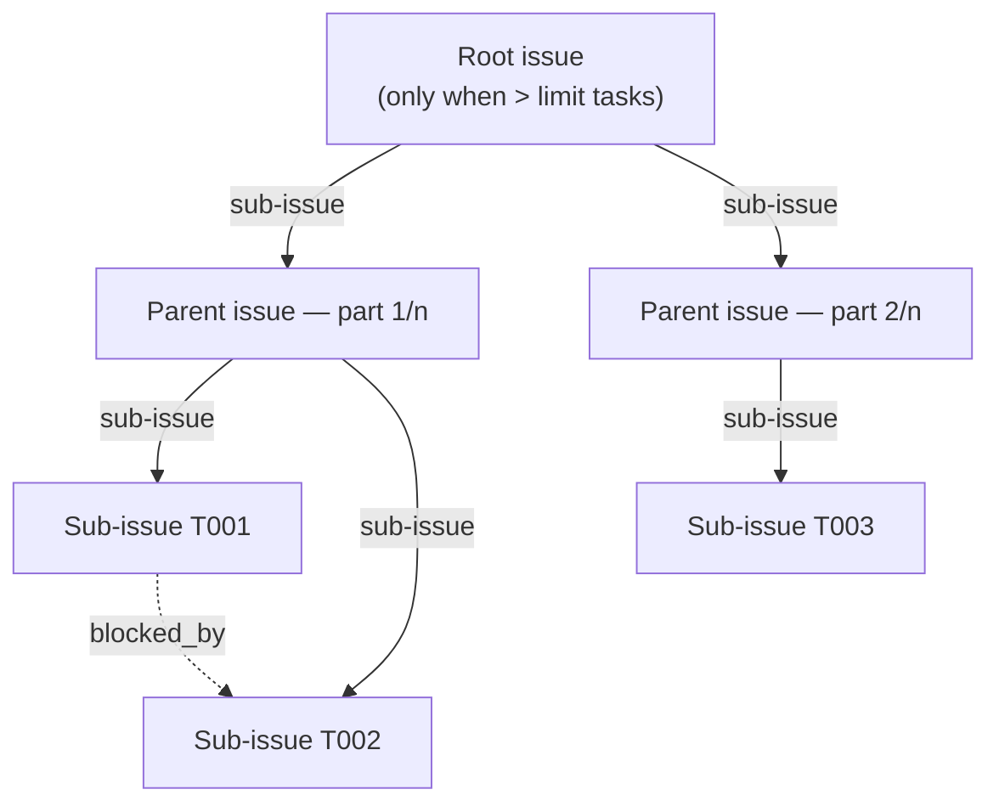

# GitHub task store (`taskstore=github`)

An **optional, opt-in** `TaskStore` adapter that projects a run's
`taskgraph.json` onto GitHub's native work-tracking primitives: a parent issue
per run, one sub-issue per task node, dependency edges, and — behind a flag —
Projects v2 fields.

> ### ⚠️ This adapter is never selected automatically. You must opt in.
>
> ```yaml
> # .adlc/config.yaml
> adapters:
>   taskstore: github
> ```
>
> `taskstore` is in `EXPLICIT_ONLY_KINDS` (`src/adlc/config.py`), so
> `select_adapter` **skips the "first detected wins" step** for it. Having
> `GITHUB_TOKEN` set is deliberately not enough.
>
> **Why:** every GitHub Actions runner exports `GITHUB_TOKEN`, and plenty of
> developer laptops have `gh` authenticated. If ambient detection selected this
> store, a plain `adlc graph` would start creating real issues in a live
> repository with nobody having asked for it. Writing to someone's issue tracker
> is not a safe default.
>
> `detect()` still runs and still reports in `adlc doctor` / `capabilities.json`
> — it just no longer *selects* this store on its own. **So if `adlc doctor`
> says the GitHub store is "available" but your run still used `sqlite`, the
> config opt-in above is what's missing.**

Without that opt-in — and with no credentials at all — the spine's
credential-free SQLite store is used and nothing here can fail the conformance
suite.

- Module: `src/adlc/adapters/taskstore/github.py`
- Entry point: `adlc.taskstore` → `github`
- Tests: `tests/l5_taskstore/` (pass with **no credentials, no network**)

---

## 1. How the DAG maps onto issues



| `taskgraph.json` | GitHub |
|---|---|
| `runId` | Parent issue (`ADLC run <runId>`) + the `adlc-run:<runId>` label on every issue |
| `nodes[]` | One sub-issue per node, titled `[T003] <title>` |
| `nodes[].dependsOn` | `POST .../dependencies/blocked_by` **and** a `Blocked by:` line + mermaid snippet in the body |
| `nodes[].kind` | `adlc-kind:<kind>` label, optional Projects v2 single-select |
| `nodes[].level` | `adlc-level:<n>` label, optional Projects v2 number field; also the chunk ordering key |
| `nodes[].writeSet` | `### Write set` section in the body |
| `nodes[].acceptance` | `### Acceptance criteria` section in the body |
| `nodes[].context` | **Not inlined.** Referenced as `.adlc/runs/<runId>/taskgraph.json` |
| task outcome | `update()` → comment + `adlc-status:<status>` label + open/closed state |

`sync()` returns `{node_id: "<owner>/<repo>#<number>"}` — a self-describing
external id, mirroring the spine SQLite store's `sqlite:<run>/<node>`. Richer
records (`id`, `number`, `node_id`, `url`) are available on `store.node_records`,
and native progress on `store.progress()`.

### Ordering and chunking

Nodes are ordered by `(level, id)` so a chunk stays level-coherent and the
projection is deterministic — the same graph always produces the same issue
layout, which is what makes re-sync a no-op.

### What is deliberately *not* in the issue body

Context capsules. They are capped at 64 KiB / 8 KiB per file / 12 files
(`adlc.ports.CAPSULE_MAX_*`) precisely so they stay bounded; dumping them into
issue bodies would blow past GitHub's 65,536-character body limit and duplicate
state that already lives in the run directory. The body links to the run
directory instead. Bodies are truncated at 60,000 characters with an explicit
marker rather than being silently rejected by the API.

---

## 2. The id-vs-number gotcha

> **`sub_issue_id` and `issue_id` are database `id`s. `issue_number` in the path
> is the `#N` humans see. They are different numbers and both are integers, so
> mixing them up fails silently or links the wrong issue.**

```http
POST /repos/{owner}/{repo}/issues/{issue_number}/sub_issues
{ "sub_issue_id": 900014 }        ←  issue.id,   NOT issue.number
```

An issue's JSON carries both:

```jsonc
{ "id": 2352034812, "number": 14, "node_id": "I_kwDOA..." }
```

- `{issue_number}` in the **path** → `issue.number` (e.g. `14`)
- `sub_issue_id` / `issue_id` in the **body** → `issue.id` (e.g. `2352034812`)
- Projects v2 GraphQL `contentId` → `issue.node_id` (e.g. `I_kwDOA...`)

Three different identifiers for one issue. This adapter keeps all three on every
record and never passes one where another is wanted.
`tests/l5_taskstore/test_sync.py::test_sub_issues_are_linked_by_id_not_number`
locks the behaviour in, using a fake whose ids are deliberately not derivable
from numbers.

### Sub-issue endpoints

| Purpose | Call | Used here |
|---|---|---|
| Attach | `POST /repos/{o}/{r}/issues/{n}/sub_issues` — `{"sub_issue_id": <id>}`, optional `"replace_parent": true` | yes |
| List | `GET /repos/{o}/{r}/issues/{n}/sub_issues` | yes, to skip already-linked children |
| Parent | `GET /repos/{o}/{r}/issues/{n}/parent` | yes, to find what to detach a retired task from |
| Detach | `DELETE /repos/{o}/{r}/issues/{n}/sub_issue` — note the **singular** path segment — `{"sub_issue_id": <id>}` | yes, when a replan drops a node (§5) |
| Reorder | `PATCH /repos/{o}/{r}/issues/{n}/sub_issues/priority` — `{"sub_issue_id", "after_id"\|"before_id"}` | no — attach order already follows `(level, id)` |

A sub-issue can have exactly one parent. If re-chunking moves a task to a
different part, the attach returns 422; the adapter retries once with
`replace_parent: true` and only then downgrades to a warning. **This means
`sync()` re-homes any task issue it owns back under its ADLC parent** — if you
move one under your own epic by hand, the next sync takes it back.

Responses carry `sub_issues_summary: {total, completed, percent_completed}`.
That is GitHub's own progress rollup, so this adapter never computes its own; it
surfaces the API's numbers via `store.summaries` and `store.progress()`.

If a node was chunked under a different parent by an earlier sync, the attach
returns 422. The adapter retries once with `replace_parent: true` to re-home it,
and only then downgrades to a warning.

---

## 3. Limits: 100 sub-issues per parent, 8 levels deep

> **Correction to the original workstream brief, which said 64.** Verified
> 2026-08-19 against
> <https://docs.github.com/en/issues/tracking-your-work-with-issues/using-issues/adding-sub-issues>:
>
> *"You can add up to **100 sub-issues per parent issue** and create up to
> **eight levels** of nested sub-issues."*

`SUB_ISSUE_LIMIT = 100` and `NESTING_DEPTH_LIMIT = 8` in the module. If GitHub
lowers the limit, or you simply want smaller parents, set
`taskstore.github.maxSubIssues` — the adapter is written against the constant,
not against the number 100.

**Graphs larger than the limit are chunked, not rejected.** Nodes are split into
parts of at most `maxSubIssues`, each part gets its own parent issue titled
`ADLC run <runId> — tasks part k/n`, and those parents are themselves attached as
sub-issues of a single **root** issue. That is 3 levels of nesting, well inside
the documented 8, and it keeps a run reachable from one entry point.

A single-part run gets no root — just one parent — so the common case stays
clean.

Only when a run needs more than `maxSubIssues` *parents* (i.e. more than 10,000
tasks at the default) does `sync()` fail, and it fails with a specific message
telling you to split the run:

```
10050 tasks need 101 parent issues, which exceeds the 100 sub-issues-per-parent
limit for the root issue. Split the run into several task graphs.
```

---

## 4. Dependencies: the API exists, but `taskgraph.json` stays authoritative

The workstream brief flagged the `blocked_by`/`blocks` creation API as
**unverified**, noting only that `issue_dependencies_summary` appeared in the
REST schema. That has changed.

**A fully documented REST API for creating issue dependencies now exists**
(verified 2026-08-19 against
<https://docs.github.com/en/rest/issues/issue-dependencies>, whose own summary
line reads *"Use the REST API to view, add, and remove issue dependencies"*):

| Purpose | Call |
|---|---|
| **Create** | `POST /repos/{o}/{r}/issues/{n}/dependencies/blocked_by` — body `{"issue_id": <id of the blocking issue>}` → `201` |
| Remove | `DELETE /repos/{o}/{r}/issues/{n}/dependencies/blocked_by/{issue_id}` (id in the **path**, not the body) |
| List blockers | `GET /repos/{o}/{r}/issues/{n}/dependencies/blocked_by` |
| List blocked | `GET /repos/{o}/{r}/issues/{n}/dependencies/blocking` |

Issue responses carry
`issue_dependencies_summary: {blocked_by, blocking, total_blocked_by, total_blocking}`.

Two things worth knowing:

1. **The relationship is only creatable from the blocked side.** There is no
   `POST .../dependencies/blocking`. To express "T001 blocks T002" you POST to
   **T002**'s `blocked_by` endpoint with **T001**'s `id`. The adapter walks
   `dependsOn`, which is already in exactly that direction.
2. **The body field is `issue_id`, not `sub_issue_id`.** The sub-issues and
   dependencies endpoints use different field names for the same kind of value.

### Why `taskgraph.json` is still the source of truth

The adapter uses the API, but only as a **projection**. It never reads
dependencies back from GitHub to make decisions.

- The executor topologically sorts and applies level barriers from
  `taskgraph.json`. Deriving that from issue links would make correctness depend
  on network state, third-party edits, and API availability.
- A stale GHES, a token without `issues:write`, or a repo with dependencies
  disabled must not stop a run. Every dependency write is therefore downgraded
  to a warning on `store.warnings` — never an exception.
- So that the graph survives regardless, **every edge is also rendered into the
  issue body** as a `Blocked by:` / `Blocks:` line plus a mermaid snippet of the
  node's neighbourhood. That rendering is unconditional and is what a human or
  an agent reads.

Set `taskstore.github.syncDependencies: false` to skip the API calls entirely and
keep only the rendered edges.

---

## 5. Idempotency

`sync()` runs on every stage of every run. It must never create a second copy of
anything. Two mechanisms combine:

**1. A stable marker establishes identity.** Every issue this adapter owns opens
with an HTML comment:

```html
<!-- adlc:run=2026-08-19-a1b2 node=T003 -->   ← one task node
<!-- adlc:run=2026-08-19-a1b2 parent=1 -->    ← parent for chunk 1
<!-- adlc:run=2026-08-19-a1b2 root=1 -->      ← root, only when chunked
```

The marker is invisible in rendered Markdown and is parsed back by
`parse_marker()`. An issue without a matching marker is never adopted, so a
human-filed issue — or a pull request, which the same list endpoint returns —
that happens to share a label is left alone.

Because the marker *is* the identity, `sync()` rejects a `runId` that cannot
survive a round trip through it (interior whitespace, or a `-->` that would
terminate the HTML comment early). Without that check a malformed `runId` would
silently re-create every issue on every sync, forever.

**2. A per-run label narrows the candidate set.** Every issue also gets
`adlc-run:<runId>` (clamped to GitHub's 50-character label limit). `sync()`
starts with a single paginated
`GET /repos/{o}/{r}/issues?labels=adlc-run:<runId>&state=all&per_page=100`, then
matches markers within that set.

> **Why not `GET /search/issues?q=... in:body`?** Search is *eventually
> consistent* — an issue created seconds ago may not be indexed yet, so a second
> `sync()` would not find it and would create a duplicate. That is precisely the
> failure this scheme has to prevent. It is also capped at 30 requests/minute.
> The issues list endpoint reads through and has no such lag, at the cost of
> needing a label to filter on. Correctness wins.

Everything else follows from those two:

- Issues are created only when the marker is absent.
- Bodies are rendered, compared to what is stored, and `PATCH`ed only if they
  differ. `sync()` runs in two passes — create everything, then re-render with
  every issue number resolved — so cross-references like `Blocked by: #12` are
  correct without a second round of churn.
- Sub-issue links and dependency edges are read first and only the missing ones
  are posted.
- Labels in the namespaces this adapter owns (`adlc-run:`, `adlc-kind:`,
  `adlc-level:`) are **replaced**, not accumulated, so a replan that changes a
  node's kind or level does not leave the issue claiming both. `adlc-status:*`
  and human-added labels are preserved.
- `update()` comments carry their own digest marker
  (`<!-- adlc:update run=… node=… digest=… -->`) and are compared against the
  **most recent** update comment for that node. Replaying the same status and
  note adds nothing; a genuine repeat transition
  (`running → fail → running`) is still recorded, because retry history is
  evidence.

### Replans: nodes that disappear

`sync()` is otherwise add-only, but a task that a replan removes from the graph
cannot simply be abandoned: it would stay linked to its parent and keep inflating
the `sub_issues_summary` denominator, so the run could never reach 100%.

For each `("node", id)` marker in the index that is no longer in the graph, the
adapter detaches the issue from its parent (`GET .../parent`, then
`DELETE .../sub_issue`) and closes it with `state_reason: not_planned`, recording
a warning. Both steps are no-ops on the next sync, so idempotency still holds.

A second `sync()` of an unchanged graph issues **zero** POST/PATCH/DELETE calls.
That is asserted directly in
`tests/l5_taskstore/test_sync.py::test_second_sync_performs_no_mutations_at_all`.

---

## 6. How the spine drives this adapter

`src/adlc/stages/graph.py` does exactly this, once per `adlc graph`:

```python
store = select_adapter(cfg, "taskstore")   # constructs with NO arguments
if hasattr(store, "bind"):
    store.bind(cfg)
store.sync(graph)
```

`select_adapter`'s order is: explicit override → `config.yaml` → first detected →
spine default. **`taskstore` is in `EXPLICIT_ONLY_KINDS`, so the "first detected"
step is skipped entirely** — this store is reachable only via the `config.yaml`
opt-in at the top of this document, or an explicit override.

Three consequences shape the design:

1. **`select_adapter` calls `cls()`.** The constructor cannot require a config,
   so `GitHubTaskStore()` is inert: it resolves nothing and opens nothing.
2. **`bind(cfg)` is the only way config arrives.** It is where the repository
   root — and therefore the git remote and the `taskstore.github` block — become
   available, so `bind()` re-resolves both. Explicit constructor arguments win
   over anything `bind()` finds, which is what makes the adapter testable.
3. **The whole call is wrapped in `try/except`** and recorded as
   `taskStore: "unavailable (<reason>)"` on the stage result. Raising is
   survivable; returning a wrong mapping silently is not. So every unrecoverable
   problem raises `GitHubTaskStoreError` with a specific message, and everything
   optional degrades to `store.warnings`.

Observed end to end, offline:

| Environment | Selected | Graph stage |
|---|---|---|
| no token, no opt-in | `sqlite` | `ok` |
| token present, **no opt-in** | `sqlite` | `ok` — ambient credentials never escalate |
| opt-in + unreachable API | `github` | `ok`, `taskStore: "unavailable (GET … failed: …refused)"` |

This adapter **never writes `run.json`** — only `adlc reduce` does. It writes
nothing to disk at all.

Note that `run_graph` discards `sync()`'s return value; the mapping is part of
the `TaskStore` contract rather than something the spine persists today.

### Run directory references

Issue bodies link to the run directory, derived from `cfg.run_dir(run_id)` and
made relative to `cfg.root` so no absolute local path leaks into a public issue.
Unbound, it falls back to `.adlc/runs/<runId>`.

---

## 7. Detection

`detect()` is cheap, non-raising, and makes **no network calls** — it reads
environment variables and, at most, one small `.git/config` file.

| Condition | Result |
|---|---|
| No `GITHUB_TOKEN` / `GH_TOKEN` | `(False, "GITHUB_TOKEN not set — falling back to sqlite task store")` |
| Token, but no repo | `(False, "GITHUB_REPOSITORY not set and no github.com git remote found — falling back to sqlite task store")` |
| Both resolved | `(True, "GitHub Issues task store available for <owner>/<repo>")` |
| Anything raises | `(False, "GitHub task store unavailable: <error>")` |

Remember that `(True, …)` reports *capability*, not selection — see the opt-in
note at the top.

The repository is resolved from, in order: `taskstore.github.repo`,
`$GITHUB_REPOSITORY`, then a `github.com` remote in `.git/config`. Worktrees are
handled — a worktree's `.git` is a *file* containing a `gitdir:` pointer, and the
adapter follows it through `commondir` to the shared config.

`https://`, `ssh://` and `git@host:owner/repo.git` remote forms are all parsed;
`$GITHUB_SERVER_URL` is honoured for GitHub Enterprise Server.

---

## 8. Token scopes

| Feature | Fine-grained PAT / GitHub App | Classic PAT |
|---|---|---|
| Create & edit issues, comments | **Issues: Read and write** | `repo` (or `public_repo`) |
| Sub-issues (attach/list/detach) | **Issues: Read and write** | `repo` |
| Issue dependencies | **Issues: Read and write** | `repo` |
| Projects v2 (optional) | **Projects: Read and write** on the project's owner | `project` (`read:project` for reads) |

The default `GITHUB_TOKEN` in GitHub Actions needs `permissions: issues: write`
in the workflow. It **cannot** write to Projects v2 — organisation projects need
a PAT or a GitHub App installation token, which is one reason Projects support is
behind a flag.

Requests send `Accept: application/vnd.github+json` and
`X-GitHub-Api-Version: 2022-11-28`. Sub-issues and dependencies are *additive*
endpoints, so they are available under that stable pin; override with
`$GITHUB_API_VERSION` if you need to.

---

## 9. Configuration

All keys live under `taskstore.github` in `.adlc/config.yaml`. The
`adapters.taskstore` opt-in is **required**; everything under `taskstore.github`
is optional.

```yaml
adapters:
  taskstore: github          # REQUIRED — this store is never auto-selected

taskstore:
  github:
    repo: acme/widgets       # overrides $GITHUB_REPOSITORY and the git remote
    maxSubIssues: 100        # lower it to make smaller parents
    syncDependencies: true   # POST blocked_by edges; body rendering is unconditional
    labels: [tracked]        # extra labels on every issue
    enableProjects: false    # Projects v2 — off by default
    projectId: PVT_kwDOA...  # or $ADLC_GITHUB_PROJECT
    projectFields:
      level: PVTF_...        # number field
      kind: PVTSSF_...       # single-select field
      kindOptions: { implement: opt_a, test: opt_b, doc: opt_c, infra: opt_d }
```

Environment: `GITHUB_TOKEN` / `GH_TOKEN`, `GITHUB_REPOSITORY`,
`GITHUB_SERVER_URL`, `GITHUB_API_URL`, `GITHUB_GRAPHQL_URL`,
`GITHUB_API_VERSION`, `ADLC_GITHUB_PROJECT`, `ADLC_RUN_ID`.

### Projects v2

Uses `addProjectV2ItemById(input: {projectId, contentId})` — `contentId` is the
issue's **`node_id`** — followed by
`updateProjectV2ItemFieldValue(input: {projectId, itemId, fieldId, value})` with
`{number: <level>}` and `{singleSelectOptionId: <id>}`.

It is entirely optional and wrapped so that *any* failure becomes a
`store.warnings` entry. `sync()` succeeds whether or not the project exists, the
token has `project` scope, or the field ids are correct.

Note that `updateProjectV2ItemFieldValue` cannot set Assignees, Labels,
Milestone or Repository — those are properties of the issue, not the project
item, which is why `level` and `kind` are also written as issue labels.

---

## 10. `update()`

```python
store.update("T003", "ok", note="patch applied cleanly")
```

| `status` | Issue state |
|---|---|
| `ok`, `done`, `complete`, `completed`, `pass`, `passed`, `merged` | closed, `state_reason: completed` |
| `skipped`, `skip`, `wont_do`, `not_planned`, `cancelled`, `canceled` | closed, `state_reason: not_planned` |
| `fail`, `failed`, `error`, `blocked`, `retry`, `replan` | open (reopened if it was closed) |
| `pending`, `queued`, `ready`, `in_progress`, `running`, `started` | open (reopened if it was closed) |

Each call posts a digest-guarded comment, replaces the `adlc-status:*` label
(rather than accumulating labels), and refreshes the parents'
`sub_issues_summary`. A repeat of the *same* status and note is suppressed; a
real transition back to a previously seen status is not (see §5).

`update()` normally reuses the index built by `sync()`. Called in a fresh
process, it re-indexes the whole run **once** using `$ADLC_RUN_ID` and caches
every node; with neither available it raises `GitHubTaskStoreError` with a
message naming the missing piece rather than failing silently.

---

## 11. Dependencies and testing

The module imports **nothing outside the standard library** — `urllib` only. No
entry was added to `pyproject.toml`.

The HTTP layer sits behind a `GitHubTransport` protocol
(`request` / `paginate` / `graphql`), so the whole projection is tested against
an in-memory GitHub double in `tests/l5_taskstore/conftest.py`. The double
enforces the invariants that matter — issue `id` is not derivable from `number`,
a sub-issue has exactly one parent — so a passing test implies working code.

`RestTransport` is the real implementation: bearer auth, `Link`-header
pagination, and bounded retries that honour `Retry-After` / `X-RateLimit-Reset`
on 403/429/5xx. It normalises *every* failure — including the raw `TimeoutError`,
`ConnectionResetError` and `http.client` exceptions that `urllib` does not
wrap — into `GitHubTaskStoreError`, so optional paths can reliably contain them.

```console
$ python -m venv .venv --system-site-packages
$ .venv/Scripts/python -m pip install -e . --no-deps
$ .venv/Scripts/python -m pytest tests/l5_taskstore -q
$ .venv/Scripts/python -m ruff check src/adlc/adapters/taskstore/
```

Both run green with no credentials and no network access.

> Use a **per-worktree venv**, not `pip install -e .` into a shared interpreter:
> the editable pointer is global, so in a multi-worktree checkout the last
> install silently wins and you end up testing someone else's code. `PYTHONPATH`
> alone is not sufficient either — entry points come from installed
> distribution metadata, so without an install `select_adapter` resolves
> nothing. The selection tests skip themselves in that case rather than
> reporting a false failure.

---

## 12. Sources

All verified 2026-08-19:

- Sub-issues REST — <https://docs.github.com/en/rest/issues/sub-issues>
- Sub-issue limits — <https://docs.github.com/en/issues/tracking-your-work-with-issues/using-issues/adding-sub-issues>
- Issue dependencies REST — <https://docs.github.com/en/rest/issues/issue-dependencies>
- List repository issues — <https://docs.github.com/en/rest/issues/issues>
- Search rate limits — <https://docs.github.com/en/rest/search>
- Projects v2 GraphQL — <https://docs.github.com/en/issues/planning-and-tracking-with-projects/automating-your-project/using-the-api-to-manage-projects>
